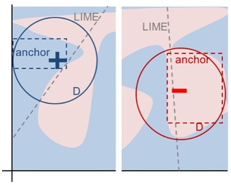

```{r, message = FALSE, warning = FALSE, echo = FALSE}
devtools::load_all()
set.seed(42)
library(anchors)
```

<!--{pagebreak}-->

## Reglas de ámbito (Anclas) {#anchors}

*Autores: Tobias Goerke y Magdalena Lang*

Anchors (*anclas*) explica las predicciones individuales de cualquier modelo de clasificación de caja negra al encontrar una regla de decisión que "ancla" la predicción lo suficiente.
Una regla ancla una predicción si los cambios en otros valores de características no afectan la predicción.
Anchors utiliza técnicas de aprendizaje de refuerzo en combinación con un algoritmo de búsqueda de gráficos para reducir el número de llamadas de modelo (y, por lo tanto, el tiempo de ejecución requerido) a un mínimo mientras aún se puede recuperar de los óptimos locales. Ribeiro, Singh y Guestrin propusieron el algoritmo en 2018 [^Ribeiro2018Anchors], los mismos investigadores que introdujeron el algoritmo [LIME](#lime).

Al igual que su predecesor, el enfoque de anclaje despliega una estrategia *basada en perturbaciones* para generar explicaciones *locales* para las predicciones de modelos de aprendizaje automático de caja negra. Sin embargo, en lugar de los modelos sustitutos utilizados por LIME, las explicaciones resultantes se expresan como reglas *SI-ENTONCES* fáciles de entender, llamadas *anchors*. Estas reglas son reutilizables ya que son *de ámbito*: los anclajes incluyen la noción de cobertura, indicando con precisión a qué otras instancias, posiblemente no vistas, se aplican. Encontrar anclas implica una exploración o un problema de bandido multibrazo, que se origina en la disciplina del aprendizaje por refuerzo. Con este fin, se crean y evalúan vecinos o perturbaciones para cada instancia que se está explicando. Hacerlo permite que el enfoque no tenga en cuenta la estructura de la caja negra y sus parámetros internos para que estos puedan permanecer sin ser observados ni alterados. Por lo tanto, el algoritmo es *modelo-agnóstico*, lo que significa que se puede aplicar a **cualquier** clase de modelo.

En su artículo, los autores comparan sus dos algoritmos y visualizan cuán diferente estos consultan el vecindario de una instancia para obtener resultados. Para esto, la siguiente figura muestra tanto LIME como anclas localmente explicando un clasificador binario complejo (predice **-** o **+**) usando dos ejemplos de instancias. Los resultados de LIME no indican cuán fieles son, ya que LIME solo aprende un límite de decisión lineal que se aproxima mejor al modelo dado un espacio de perturbación $D$. Dado el mismo espacio de perturbación, el enfoque de anclajes construye explicaciones cuya cobertura se adapta al comportamiento del modelo y expresa claramente sus límites. Por lo tanto, son fieles por diseño y establecen exactamente para qué instancias son válidas. Esta propiedad hace que las anclas sean particularmente intuitivas y fáciles de comprender.

```{r fig.cap="LIME vs. Anchors -- Una visualización. Figura de Ribeiro, Singh, and Guestrin (2018).", out.width=350, fig.align="center"}

```

Como se mencionó anteriormente, los resultados o las explicaciones del algoritmo vienen en forma de reglas, llamadas anclas. El siguiente ejemplo simple ilustra tal ancla. Por ejemplo, supongamos que se nos da un modelo bivariado de caja negra que predice si un pasajero sobrevive o no al desastre del Titanic. Ahora nos gustaría saber *por qué* el modelo predice para un individuo específico que sobrevive. El algoritmo de anclaje proporciona una explicación de resultados como la que se muestra a continuación.


| Feature           | Value         |
| ----------------- |:-------------:|
| Edad              | 20            |
| Sexo              | femenino      |
| Clase             | primera       |
| Precio del ticket | 300\$         |
| Más atributos     | ...           |
| **Sobrevive**     | **TRUE**      |

Y la explicación de anclajes correspondiente es:

SI `SEXO = femenino`  
Y `Clase = primero`  
ENTONCES `Sobrevive = TRUE`  
CON PRECISIÓN `97%`  
Y COBERTURA `15%`  

El ejemplo muestra cómo las anclas pueden proporcionar información esencial sobre la predicción de un modelo y su razonamiento subyacente. El resultado muestra qué atributos fueron tomados en cuenta por el modelo, que en este caso es el sexo femenino y la primera clase. Los seres humanos, siendo primordiales para la corrección, pueden usar esta regla para validar el comportamiento del modelo. El ancla adicionalmente nos dice que se aplica al 15\% de las instancias del espacio de perturbación. En esos casos, la explicación es 97\% precisa, lo que significa que los predicados mostrados son casi exclusivamente responsables del resultado predicho.

Un ancla $A$ se define formalmente de la siguiente manera:

$$\mathbb{E}_{\mathcal{D}_x(z|A)}[1_{f(x)=f(z)}]\geq\tau,A(x)=1$$

Donde:

+ $x$ representa la instancia que se está explicando (por ejemplo, una fila en un conjunto de datos tabular).
+ $A$ es un conjunto de predicados, es decir, la regla o ancla resultante, de modo que $A(x)=1$ cuando todos los predicados de entidad definidos por $A$ corresponden a los valores de característica de $x$.
+ $f$ denota el modelo de clasificación que se explicará (por ejemplo, un modelo de red neuronal artificial). Se puede consultar para predecir una etiqueta para $x$ y sus perturbaciones.
+ $D_x(\cdot|A)$ indica la distribución de vecinos de $x$, que coincide con $A$.
+ $0\leq\tau\leq1$ especifica un umbral de precisión. Solo las reglas que logran una fidelidad local de al menos $\tau$ se consideran un resultado válido.

La descripción formal puede ser intimidante y puede expresarse en palabras:

> Dada una instancia $x$ para ser explicada, se debe encontrar una regla o un ancla $A$, de modo que se aplique a $x$, mientras que la misma clase que para $x$ se predice por una fracción de al menos $\tau$ de los vecinos de $x$ donde se aplica el mismo $A$. La precisión de una regla resulta de la evaluación de vecinos o perturbaciones (siguiendo $D_x(z|A)$) usando el modelo de aprendizaje automático proporcionado (indicado por la función de indicador $1_{f(x)=f(z)}$).


### Encontrar anclas


Aunque la descripción matemática de los anclajes puede parecer clara y directa, no es factible construir reglas particulares. Se requeriría evaluar $1_{f(x)=f(z)}$ para todos $z\in\mathcal{D}_x(\cdot|A)$ que no es posible en espacios de entrada continuos o grandes. Por lo tanto, los autores proponen introducir el parámetro $0\leq\delta\leq1$ para crear una definición probabilística. De esta forma, se extraen muestras hasta que haya una confianza estadística con respecto a su precisión. La definición probabilística dice lo siguiente:

$$P(prec(A)\geq\tau)\geq{}1-\delta\quad\textrm{con}\quad{}prec(A)=\mathbb{E}_{\mathcal{D}_x(z|A)}[1_{f(x)=f(z)}]$$

Las dos definiciones anteriores se combinan y amplían por la noción de cobertura. Su fundamento consiste en encontrar reglas que se apliquen a una parte preferiblemente grande del espacio de entrada del modelo. La cobertura se define formalmente como la probabilidad de un ancla de aplicar a sus vecinos, es decir, su espacio de perturbación:

$$cov(A)=\mathbb{E}_{\mathcal{D}_{(z)}[A(z)]}$$ 

La inclusión de este elemento lleva a la definición final de los anclajes teniendo en cuenta la maximización de la cobertura:

$$\underset{A\:\textrm{s.t.}\;P(prec(A)\geq\tau)\geq{}1-\delta}{\textrm{max}}cov(A)$$

Por lo tanto, el procedimiento busca una regla que tenga la cobertura más alta entre todas las reglas elegibles (todas aquellas que satisfacen el umbral de precisión dada la definición probabilística). Se cree que estas reglas son más importantes, ya que describen una parte más grande del modelo.
Ten en cuenta que las reglas con más predicados tienden a tener mayor precisión que las reglas con menos predicados. En particular, una regla que corrige cada característica de $x$ reduce el vecindario evaluado a instancias idénticas. Por lo tanto, el modelo clasifica a todos los vecinos por igual, y la precisión de la regla es $1$. Al mismo tiempo, una regla que corrige muchas características es demasiado específica y solo es aplicable en algunas instancias. Por lo tanto, existe una *compensación entre precisión y cobertura*.

El enfoque de anclaje utiliza cuatro componentes principales para encontrar explicaciones, como se muestra en la figura a continuación.

**Generación de candidatos**: genera nuevos candidatos de explicación. En la primera ronda, se crea un candidato por función de $x$ y se corrige el valor respectivo de posibles perturbaciones. En cada otra ronda, los mejores candidatos de la ronda anterior se extienden por un predicado de característica que aún no está contenido en él.

**Identificación del mejor candidato**: Las reglas de los candidatos deben compararse con respecto a qué regla explica mejor $x$. Para este fin, las perturbaciones que coinciden con la regla observada actualmente se crean evaluando llamando al modelo. Sin embargo, estas llamadas deben minimizarse para limitar la sobrecarga computacional. Es por eso que, en el núcleo de este componente, existe un Multi-Armed-Bandit de exploración pura (*MAB*; *KL-LUCB*[^KLLUCB], para ser precisos). Los MAB se utilizan para explorar y explotar de manera eficiente diferentes estrategias (llamadas brazos en una analogía con las máquinas tragamonedas) mediante la selección secuencial. En el entorno dado, cada regla candidata se debe ver como un brazo que se puede tirar. Cada vez que se tira, se evalúa a los vecinos respectivos y, por lo tanto, obtenemos más información sobre el resultado de la regla del candidato (precisión en el caso de los anclajes). La precisión así establece qué tan bien la regla describe la instancia a ser explicada.

**Validación de precisión del candidato**: toma más muestras en caso de que aún no haya confianza estadística de que el candidato exceda el umbral de $\tau$.

**Búsqueda en haz modificada**: Todos los componentes anteriores se ensamblan en una búsqueda de haz, que es un algoritmo de búsqueda gráfica y una variante del algoritmo de amplitud. Lleva a los $B$ mejores candidatos de cada ronda a la siguiente (donde $B$ se llama *Beam Width*). Estas mejores reglas de $B$ se utilizan para crear nuevas reglas. La búsqueda de haces realiza como máximo $featureCount(x)$ rondas, ya que cada característica solo se puede incluir en una regla como máximo una vez. Por lo tanto, en cada ronda $i$, genera candidatos con exactamente $i$ predicados y selecciona el B mejor de los mismos. Por lo tanto, al establecer $B$ alto, es más probable que el algoritmo evite los óptimos locales. A su vez, esto requiere una gran cantidad de llamadas de modelo y, por lo tanto, aumenta la carga computacional.

```{r fig.cap="Los componentes del algoritmo de anclaje y sus interrelaciones (simplificadas)", out.width = 800}
knitr::include_graphics("images/anchors-process.jpg")
```

El enfoque es una receta aparentemente perfecta para derivar eficientemente información estadísticamente sólida sobre por qué cualquier sistema clasificó una instancia de la manera en que lo hizo. Experimenta sistemáticamente con la entrada del modelo y concluye observando las salidas respectivas. Se basa en métodos de aprendizaje automático (MAB) bien establecidos e investigados para reducir la cantidad de llamadas realizadas al modelo. Esto, a su vez, reduce drásticamente el tiempo de ejecución del algoritmo.

### Complejidad y tiempo de ejecución

Conocer el comportamiento asintótico del tiempo de ejecución del enfoque de anclaje ayuda a evaluar qué tan bien se espera que funcione en problemas específicos. Deja que $B$ denote el ancho del haz y $p$ el número de todas las características. Entonces el algoritmo de anclaje está sujeto a:

$$\mathcal{O}(B\cdot{}p^2+p^2\cdot\mathcal{O}_{\textrm{MAB}\lbrack{}B\cdot{}p,B\rbrack})$$

Este límite se extrae de hiperparámetros independientes del problema, como la confianza estadística $\delta$. Ignorar los hiperparámetros ayuda a reducir la complejidad del límite (consulte el documento original para obtener más información). Como el MAB extrae los $B$ mejores de los candidatos $B\cdotp$ en cada ronda, la mayoría de los MAB y sus tiempos de ejecución multiplican el factor $p^2$ más que cualquier otro parámetro.

Por lo tanto, se hace evidente: la eficiencia del algoritmo disminuye con problemas abundantes de características.


### Ejemplo de datos tabulares

Los datos tabulares son datos estructurados representados por tablas, en donde las columnas incorporan características y las filas son instancias.
Por ejemplo, utilizamos los [datos de alquiler de bicicletas](#bike-data) para demostrar el potencial del enfoque de los anclajes para explicar las predicciones de LD para las instancias seleccionadas. Para esto, convertimos la regresión en un problema de clasificación y entrenamos un random forest como nuestro modelo de caja negra. Es para clasificar si el número de bicicletas alquiladas se encuentra por encima o por debajo de la línea de tendencia.

Antes de crear explicaciones de anclaje, es necesario definir una función de perturbación. Una manera fácil de hacerlo es usar un espacio de perturbación intuitivo predeterminado para casos de explicación tabular que se pueden construir mediante el muestreo, por ejemplo, de los datos de entrenamiento.
Al perturbar una instancia, este enfoque predeterminado mantiene los valores de las características que están sujetos a los predicados de los anclajes, mientras reemplaza las características no fijas con valores tomados de otra instancia muestreada al azar con una probabilidad específica. Este proceso produce nuevas instancias que son similares a las explicadas pero que han adoptado algunos valores de otras instancias aleatorias. Por lo tanto, se parecen a los vecinos.

```{r results='hide', cache=FALSE}
library(anchors)
library(jsonlite)
library(BBmisc)
library(uuid)
library(magrittr)
set.seed(1)

colPal = c("#555555","#DFAD47","#7EBCA9", "#E5344E", "#681885", "#d25d97", "#fd3c46", "#ff9a39", "#6893bf", "#42c3a8")
data(bike)

bike$target = factor(resid(lm(cnt ~ days_since_2011, data = bike)) > 0, 
                     levels = c(FALSE, TRUE), labels = c('below', 'above'))
bike$cnt = NULL
# Make long factor levels shorter
levels(bike$weathersit)[levels(bike$weathersit)=="RAIN/SNOW/STORM"] <- "BAD"


bike.task = makeClassifTask(data = bike, target = "target")
```

```{r results='hide',  eval = FALSE}
# If you want to update anchors, make sure to set eval=TRUE and add the RDS files to the repository
devtools::install_github("viadee/anchorsOnR")
library(anchors)
library(jsonlite)
library(BBmisc)
library(uuid)
library(magrittr)
set.seed(1)


mod = mlr::train(mlr::makeLearner(cl = 'classif.randomForest', 
                                  id = 'bike-rf'), bike.task)
bikeDisc = list(
  integer(),
  integer(),
  integer(),
  integer(),
  integer(),
  integer(),
  integer(),
  c(0, 7, 14, 21, 28),
  c(30, 60, 69, 92),
  c(5, 10, 15, 20, 25),
  integer()
)

bike.explainer = anchors(bike, mod, target = "target", bins = bikeDisc, tau = 0.9, batchSize = 1000, beams = 1)
bike.explained.instances = bike[c(40, 475, 610, 106, 200, 700),] 
bike.explanations = anchors::explain(bike.explained.instances, bike.explainer)
saveRDS(bike.explanations, file = "../data/cached-anchors.RDS")

bike.explainer_edge = anchors(bike, mod, target = "target", tau = 1, batchSize = 1000, beams = 1, allowSuboptimalSteps = F)
bike.explained.instances_edge = bike[c(452, 300),] 
bike.explanations_edge = anchors::explain(bike.explained.instances_edge, bike.explainer_edge)
saveRDS(bike.explanations_edge, file = "../data/cached-anchors-edge.RDS")
```


```{r message=FALSE, cache=TRUE, fig.cap="Anclajes que explican seis instancias del conjunto de datos de alquiler de bicicletas. Cada fila representa una explicación o ancla, y cada barra representa los predicados de características que contiene. el eje muestra la precisión de una regla, y el grosor de una barra corresponde a su cobertura. La regla 'base' no contiene predicados. Estos anclajes muestran que el modelo considera principalmente la temperatura para las predicciones.", fig.height=10, fig.width=10}
bike.explanations = readRDS("C:/Users/Federico/Documents/GitHub/interpretable-ml-book/bookdown-fjf-v3/data/cached-anchors.RDS")
plotExplanations(bike.explanations, colPal = colPal)
```

Los resultados son instintivamente interpretables y muestran para cada instancia explicada, qué características son más importantes para la predicción del modelo. Como las anclas solo tienen unos pocos predicados, además tienen una alta cobertura y, por lo tanto, se aplican a otros casos.
Las reglas que se muestran arriba se generaron con $\tau=0.9$. Por lo tanto, solicitamos anclajes cuyas perturbaciones evaluadas respalden fielmente la etiqueta con una precisión de al menos $90\%$. Además, se utilizó la discretización para aumentar la expresividad y la aplicabilidad de las características numéricas.

Todas las reglas anteriores se generaron para instancias en las que el modelo decide con confianza en función de algunas características. Sin embargo, otras instancias no están tan claramente clasificadas por el modelo como más características son importantes. En tales casos, los anclajes se vuelven más específicos, comprenden más características y se aplican a menos instancias.

```{r message=FALSE, warning=FALSE, echo=FALSE, results='hide', cache=TRUE, fig.cap="Explicar instancias cerca de los límites de decisión conduce a reglas específicas que comprenden un mayor número de predicados de características y menor cobertura. Además, la regla vacía, es decir, la característica base, se vuelve menos importante. Esto puede interpretarse como una señal para un límite de decisión, ya que la instancia se encuentra en un vecindario volátil.", fig.height=9, fig.width=10}
bike.explanations_edge = readRDS("C:/Users/Federico/Documents/GitHub/interpretable-ml-book/bookdown-fjf-v3/data/cached-anchors-edge.RDS")
plotExplanations(bike.explanations_edge, colPal = colPal)
```


Si bien elegir el espacio de perturbación predeterminado es una opción cómoda, puede tener un gran impacto en el algoritmo y, por lo tanto, puede conducir a resultados sesgados. Por ejemplo, si el conjunto de trenes no está equilibrado (hay un número desigual de instancias de cada clase), el espacio de perturbación también lo está. Esta condición afecta aún más la búsqueda de reglas y la precisión del resultado.

El conjunto de datos [cáncer cervical](#cervical) es un excelente ejemplo de esta situación. La aplicación del algoritmo de anclaje conduce a una de las siguientes situaciones:

+ Al explicar las instancias etiquetadas como *saludable* se obtienen reglas vacías ya que todos los vecinos generados se evalúan como *saludables*.
+ Las explicaciones para las instancias etiquetadas como *cancer* son demasiado específicas, es decir, comprenden muchos predicados de características, ya que el espacio de perturbación cubre principalmente valores de instancias *saludables*.

```{r}
data(cervical)
cervical.sampled.healthy <- cervical[sample(which(cervical$Biopsy == "Healthy"), 20), ]
cervical.balanced <- rbind(cervical[cervical$Biopsy == "Cancer", ], cervical.sampled.healthy)
```


```{r message=FALSE, warning=FALSE, echo=FALSE, results='hide',  eval = FALSE}
set.seed(1)

cervical.task = makeClassifTask(data = cervical, target = "Biopsy")
mod = mlr::train(mlr::makeLearner(cl = 'classif.randomForest', id = 'cervical-rf', 
                                  predict.type = 'prob'), cervical.task)
cancer.explainer = anchors(cervical, mod, beams = 1)
cancer.explanation = anchors::explain(cervical[c(1,7),], cancer.explainer)
saveRDS(cancer.explanation, file = "../data/cached-anchors-cervical.RDS")


set.seed(1)
cancer.explainer.balanced = anchors(cervical.balanced, mod, tau = 1, beams = 2,
                                    delta = 0.05, epsilon = 0.05, batchSize = 1000,
                                    emptyRuleEvaluations = 1000)
cancer.explanation.balanced = anchors::explain(cervical.sampled.healthy[2:5,], cancer.explainer.balanced)
saveRDS(cancer.explanation.balanced, file = "../data/cached-anchors-cervical-balanced.RDS")
```


```{r message=FALSE, warning=FALSE, echo=FALSE, results='hide', cache=TRUE, fig.cap="La construcción de anclajes dentro de espacios de perturbación desequilibrados conduce a resultados inexpresivos.", fig.height=10, fig.width=10}
cancer.explanation = readRDS("C:/Users/Federico/Documents/GitHub/interpretable-ml-book/bookdown-fjf-v3/data/cached-anchors-cervical.RDS")
plotExplanations(cancer.explanation, colPal = colPal)
```

Este resultado puede ser no deseado y puede abordarse de múltiples maneras. Por ejemplo, se puede definir un espacio de perturbación personalizado que muestree de manera diferente, por ejemplo, de un conjunto de datos no balanceados o una distribución normal. Sin embargo, esto tiene un efecto secundario: los vecinos muestreados no son representativos y cambian el alcance de la cobertura. Alternativamente, podríamos modificar la confianza del MAB $\delta$ y los valores de los parámetros de error $\epsilon$. Esto provocaría que el MAB extraiga más muestras, lo que en última instancia llevaría a la minoría a tomar muestras con mayor frecuencia en términos absolutos.

Para este ejemplo, utilizamos un subconjunto del conjunto de cáncer de cuello uterino en el que la mayoría de los casos están etiquetados como *cáncer*. Luego tenemos el marco para crear un espacio de perturbación correspondiente a partir de él. Las perturbaciones ahora tienen más probabilidades de conducir a predicciones variables, y el algoritmo de anclaje puede identificar características importantes. Sin embargo, uno debe tener en cuenta la definición de cobertura: solo se define dentro del espacio de perturbación. En los ejemplos anteriores, utilizamos el conjunto de trenes como base del espacio de perturbación. Dado que aquí solo usamos un subconjunto, una cobertura alta no necesariamente indica una importancia de regla globalmente alta.

```{r message=FALSE, warning=FALSE, echo=FALSE, results='hide', cache=TRUE, fig.cap="Balancear el dataset antes de construir anclas muestra el razonamiento del modelo para decidir en casos de minorías.", fig.height=10, fig.width=11}
cancer.explanation.balanced = readRDS("C:/Users/Federico/Documents/GitHub/interpretable-ml-book/bookdown-fjf-v3/data/cached-anchors-cervical-balanced.RDS")
table(cervical.balanced$Biopsy)
plotExplanations(cancer.explanation.balanced, colPal = colPal)
```


### Ventajas

El enfoque de los anclajes ofrece múltiples ventajas sobre LIME. Primero, la salida del algoritmo es más fácil de entender, ya que las reglas son **fáciles de interpretar** (incluso para los laicos).

Además, se **pueden generar subconjuntos de anclajes** e incluso establecen una medida de importancia al incluir la noción de cobertura. En segundo lugar, el enfoque de anclajes **funciona cuando las predicciones del modelo son no lineales o complejas** en el vecindario de una instancia. A medida que el enfoque despliega técnicas de aprendizaje por refuerzo en lugar de ajustar modelos sustitutos, es menos probable que no se ajuste al modelo.

Aparte de eso, el algoritmo es **modelo-agnóstico** y, por lo tanto, aplicable a cualquier modelo.

Además, es **altamente eficiente, ya que se puede paralelizar** mediante el uso de MAB que admiten el muestreo por lotes (por ejemplo, BatchSAR).

### Desventajas

El algoritmo tiene una configuración **altamente configurable** e impactante, al igual que la mayoría de los explicadores basados en perturbaciones. No solo los hiperparámetros, como el ancho del haz o el umbral de precisión, deben ajustarse para obtener resultados significativos, sino que también la función de perturbación debe diseñarse explícitamente para un dominio/caso de uso. Piensa en cómo se perturban los datos tabulares y piensa en cómo aplicar los mismos conceptos a los datos de imagen (Sugerencia: no se pueden aplicar). Afortunadamente, los enfoques predeterminados se pueden usar en algunos dominios (por ejemplo, tabular), lo que facilita una configuración de explicación inicial.

Además, **muchos escenarios requieren discretización** ya que de lo contrario los resultados son demasiado específicos, tienen una cobertura baja y no contribuyen a comprender el modelo. Si bien la discretización puede ayudar, también puede difuminar los límites de decisión si se usa descuidadamente y, por lo tanto, tiene el efecto opuesto exacto. Dado que no existe la mejor técnica de discretización, los usuarios deben conocer los datos antes de decidir cómo discretizar los datos para no obtener malos resultados.

La construcción de anclajes requiere **muchas llamadas al modelo ML**, al igual que todos los explicadores basados en perturbaciones. Si bien el algoritmo implementa MAB para minimizar el número de llamadas, su tiempo de ejecución aún depende en gran medida del rendimiento del modelo y, por lo tanto, es muy variable.

Por último, la noción de **cobertura no está definida en algunos dominios**. Por ejemplo, no existe una definición obvia o universal de cómo los superpíxeles en una imagen se comparan con los de otras imágenes.

### Software y alternativas

Actualmente hay dos implementaciones disponibles: [anchor, un paquete de Python](https://github.com/marcotcr/anchor) (también integrado por [Alibi](https://github.com/SeldonIO/alibi)) y una [Implementación de Java](https://github.com/viadee/javaAnchorExplainer).
El primero es la referencia de los autores del algoritmo de anclaje y el segundo una implementación de alto rendimiento que viene con una interfaz R, llamada [anchors](https://github.com/viadee/anchorsOnR), que se utilizó para los ejemplos en este capítulo.
A partir de ahora, los anclajes solo admiten datos tabulares. Sin embargo, los anclajes pueden construirse teóricamente para cualquier dominio o tipo de datos.

[^Ribeiro2018Anchors]: Marco Tulio Ribeiro, Sameer Singh, Carlos Guestrin. "Anchors: High-Precision Model-Agnostic Explanations." AAAI Conference on Artificial Intelligence (AAAI), 2018

[^KLLUCB]: Emilie Kaufmann and Shivaram Kalyanakrishnan. “Information Complexity in Bandit Subset Selection”. Proceedings of Machine Learning Research (2013).
