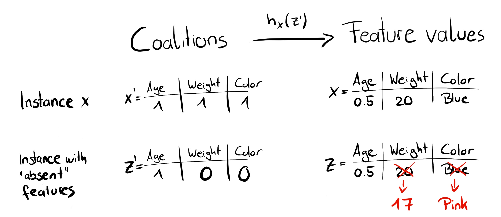
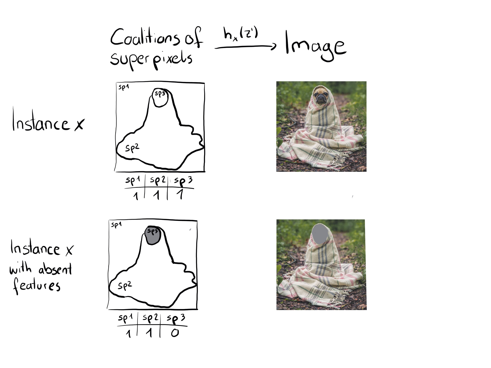

```{r, message = FALSE, warning = FALSE, echo = FALSE}
devtools::load_all()
set.seed(42)
```

<!--{pagebreak}-->

## SHAP (explicaciones aditivas SHapley) {#shap}

SHAP (explicaciones aditivas SHapley) de Lundberg y Lee (2016)[^lundberg2016] es un método para explicar las predicciones individuales.
SHAP se basa en los [valores de Shapley](#shapley).

Hay dos razones por las que SHAP tiene su propio capítulo y no es un subcapítulo de [valores de Shapley](#shapley).
Primero, los autores de SHAP propusieron KernelSHAP, un enfoque de estimación alternativo basado en el núcleo para los valores de Shapley inspirados en [modelos sustitutos locales](#lime).
Y propusieron TreeSHAP, un enfoque de estimación eficiente para modelos basados en árboles.
En segundo lugar, SHAP viene con muchos métodos de interpretación global basados en agregaciones de valores de Shapley.
Este capítulo explica tanto los nuevos enfoques de estimación como los métodos de interpretación global.

Recomiendo leer los capítulos sobre [valores de Shapley](#shapley) y [modelos locales (LIME)](#lime) primero.

### Definición

El objetivo de SHAP es explicar la predicción de una instancia x calculando la contribución de cada característica a la predicción.
El método de explicación SHAP calcula los valores de Shapley a partir de la teoría de juegos de coalición.
Los valores de características de una instancia de datos actúan como jugadores en una coalición.
Los valores de Shapley nos dicen cómo distribuir equitativamente el "pago" (= la predicción) entre las características.
Un jugador puede ser un valor de característica individual, por ejemplo en datos tabulares.
Un jugador también puede ser un grupo de valores de características.
Por ejemplo, para explicar una imagen, los píxeles se pueden agrupar en superpíxeles y la predicción se puede distribuir entre ellos.
Una innovación que SHAP trae a la mesa es que la explicación del valor de Shapley se representa como un método de atribución de características aditivas, un modelo lineal.
Esa vista conecta los valores Shapley y LIME.
SHAP especifica la explicación como:

$$g(z')=\phi_0+\sum_{j=1}^M\phi_jz_j'$$

donde g es el modelo de explicación, $z'\in\{0,1\}^M$ es el vector de coalición, M es el tamaño máximo de la coalición y $\phi_j\in\mathbb{R}$ es la atribución de características para una característica j, los valores de Shapley.
Lo que llamo "vector de coalición" se llama "características simplificadas" en el paper SHAP.
Creo que este nombre fue elegido porque, por ejemplo, en datos de imágenes estas no se representan en el nivel de píxeles, sino que se agregan a superpíxeles.
Creo que es útil pensar en las z como descripciones de coaliciones:
En el vector de coalición, una entrada de 1 significa que el valor de la característica correspondiente está "presente" y 0 que está "ausente".
Esto debería sonarte familiar si conoces los valores de Shapley.
Para calcular los valores de Shapley, simulamos que solo se están reproduciendo algunos valores de características ("presente") y otros no ("ausentes").
La representación como modelo lineal de coaliciones es un truco para el cálculo de los $\phi$'s.
Para x, la instancia de interés, el vector de coalición x' es un vector de todos los 1, es decir, todos los valores de características están "presentes".
La fórmula se simplifica a:

$$g(x')=\phi_0+\sum_{j=1}^M\phi_j$$

Puedes encontrar esta fórmula en notación similar en el capítulo [Valor de Shapley](#shapley).
Más tarde veremos más información sobre la estimación real.
Hablemos primero sobre las propiedades de los $\phi$'s antes de entrar en los detalles de su estimación.

<!-- Propiedades deseables -->
Los valores de Shapley son la única solución que satisface las propiedades de eficiencia, simetría, simulación y aditividad.
SHAP también los satisface, ya que calcula los valores de Shapley.
En el trabajo SHAP, encontrarás discrepancias entre las propiedades SHAP y las propiedades Shapley.
SHAP describe las siguientes tres propiedades deseables:

**1) Precisión local**

$$f(x)=g(x')=\phi_0+\sum_{j=1}^M\phi_jx_j'$$

Si defines $\phi_0=E_X(\hat{f}(x))$ y estableces todos $x_j'$ en 1, esta es la propiedad de eficiencia Shapley.
Solo con un nombre diferente y usando el vector de coalición.

$$f(x)=\phi_0+\sum_{j=1}^M\phi_jx_j'=E_X(\hat{f}(X))+\sum_{j=1}^M\phi_j$$

**2) Ausencia**

$$x_j'=0\Rightarrow\phi_j=0$$

La ausencia dice que una característica faltante obtiene una atribución de cero.
Ten en cuenta que $x_j'$ se refiere a las coaliciones, donde un valor de 0 representa la ausencia de un valor de característica.
En la notación de coalición, todos los valores de características $x_j'$ de la instancia a explicar deben ser '1'.
La presencia de un 0 significaría que falta el valor de la característica para la instancia de interés.
Esta propiedad no se encuentra entre las propiedades de los valores Shapley "normales".
Entonces, ¿por qué lo necesitamos para SHAP?
Lundberg lo llama una ["propiedad menor de contabilidad"](https://github.com/slundberg/shap/issues/175#issuecomment-407134438).
Una característica faltante podría, en teoría, tener un valor de Shapley arbitrario sin dañar la propiedad de precisión local, ya que se multiplica por $x_j'= 0$.
La propiedad de ausencia exige que las características faltantes obtengan un valor Shapley de 0.
En la práctica, esto solo es relevante para las características que son constantes.

**3) Consistencia**

Deja que $f_x(z')=f(h_x(z'))$ y $z_{\setminus{}j'}$ indiquen que $z_j'=0$.
Para cualquiera de los dos modelos f y f' que satisfacen:

$$f_x'(z')-f_x'(z_{\setminus{}j}')\geq{}f_x(z')-f_x(z_{\setminus{}j}')$$

para todas las entradas $z'\in\{0,1\}^M$, entonces:

$$\phi_j(f',x)\geq\phi_j(f,x)$$

La propiedad de consistencia dice que cuando un modelo cambie de modo que la contribución marginal de un valor de entidad aumente o permanezca igual (independientemente de otras características), el valor de Shapley también debe aumentar o permanecer igual.
A partir de la consistencia, siguen las propiedades de Shapley Linealidad, Dummies y Simetría, como se describe en el Apéndice de Lundberg y Lee.

### KernelSHAP

<!-- La idea general del modelo lineal -->
KernelSHAP estima para una instancia x las contribuciones de cada valor de característica a la predicción.
KernelSHAP consta de 5 pasos:

- Ejemplos de coaliciones $z_k'\in\{0,1\}^M,\quad{}k\in\{1,\ldots,K\}$ (1 = característica presente en la coalición, 0 = característica ausente).
- Obtiene las predicciones para cada $z_k'$ convirtiendo primero $z_k'$ en el espacio de características original y luego aplicando el modelo f: $f(h_x(z_k'))$
- Calcula el peso de cada $z_k'$ con el kernel SHAP.
- Ajusta el modelo lineal ponderado.
- Devuelva los valores de Shapley $\phi_k$, los coeficientes del modelo lineal.

Podemos crear una coalición aleatoria mediante lanzamientos de monedas repetidos hasta que tengamos una cadena de 0 y 1.
Por ejemplo, el vector de (1,0,1,0) significa que tenemos una coalición de las características primera y tercera.
Las coaliciones de muestra K se convierten en el conjunto de datos para el modelo de regresión.
El objetivo del modelo de regresión es la predicción para una coalición.
("¡Espera!", Dirás, "El modelo no ha sido entrenado en estos datos de coalición binaria y no puede hacer predicciones para ellos").
Para pasar de coaliciones de valores de entidades a instancias de datos válidas, necesitamos una función $h_x(z')=z$ donde $h_x:\{0,1\}^M\rightarrow\mathbb{R}^p$.
La función $h_x$ asigna 1's al valor correspondiente de la instancia x que queremos explicar.
Para los datos tabulares, asigna los 0 a los valores de otra instancia que tomamos de los datos.
Esto significa que equiparamos "el valor de la característica está ausente" con "el valor de la característica se reemplaza por el valor de la característica aleatorio de los datos".
Para datos tabulares, la siguiente figura visualiza la asignación de coaliciones a valores de características:

```{r shap-simplified-feature, fig.cap = "La función $h_x$ asigna una coalición a una instancia válida. Para las características actuales (1), $h_x$ asigna a los valores de característica de x. Para características ausentes (0), $h_x$ se asigna a los valores de una instancia de datos muestreados aleatoriamente.", out.width = 800}

```

En un mundo perfecto, $h_x$ muestrea los valores de características ausentes condicionales a los valores de características actuales:

$$f(h_x(z'))=E_{X_C|X_S}[f(x)|x_S]$$

donde $X_C$ es el conjunto de características ausentes y $X_S$ es el conjunto de características actuales.
Sin embargo, como se definió anteriormente, $h_x$ para datos tabulares trata a $X_C$ y $X_S$ como independientes e integra sobre la distribución marginal:

$$f(h_x(z'))=E_{X_C}[f(x)]$$

El muestreo de la distribución marginal significa ignorar la estructura de dependencia entre las características presentes y ausentes.
Por lo tanto, KernelSHAP sufre el mismo problema que todos los métodos de interpretación basados en permutación.
La estimación pone demasiado peso en casos improbables.
Los resultados pueden volverse poco confiables.
Como veremos más adelante, TreeSHAP para los conjuntos de árboles no se ve afectado por este problema.

Para las imágenes, la siguiente figura describe una posible función de mapeo:

```{r fig.cap = "La función $h_x$ asigna coaliciones de superpíxeles (sp) a imágenes. Los superpíxeles son grupos de píxeles. Para las características actuales (1), $h_x$ devuelve la parte correspondiente del original imagen. Para las funciones ausentes (0), $h_x$ atenúa el área correspondiente. Asignar el color promedio de los píxeles circundantes o similar también sería una opción.", out.width = 800}

```
<!-- Kernel -->
La gran diferencia con LIME es la ponderación de las instancias en el modelo de regresión.
LIME pondera las instancias según lo cerca que estén de la instancia original.
Cuantos más ceros haya en el vector de coalición, menor será el peso en LIME.
SHAP pondera las instancias muestreadas de acuerdo con el peso que obtendría la coalición en la estimación del valor de Shapley.
Las coaliciones pequeñas (pocos 1) y las coaliciones grandes (es decir, muchos 1) obtienen los mayores pesos.
La intuición detrás de esto es:
Aprendemos más sobre las características individuales si podemos estudiar sus efectos de forma aislada.
Si una coalición consta de una sola característica, podemos aprender sobre el efecto principal aislado de las características en la predicción.
Si una coalición consta de todas las características menos una, podemos aprender sobre el efecto total de esta característica (efecto principal más interacciones de características).
Si una coalición consta de la mitad de las características, aprendemos poco acerca de una contribución de características individuales, ya que hay muchas coaliciones posibles con la mitad de las características.
Para lograr la ponderación compatible con Shapley, Lundberg et. Al proponen el núcleo SHAP:

$$\pi_{x}(z')=\frac{(M-1)}{\binom{M}{|z'|}|z'|(M-|z'|)}$$

Aquí, M es el tamaño máximo de la coalición y $|z'|$ el número de características presentes en la instancia z'.
Lundberg y Lee muestran que la regresión lineal con este peso del Kernel produce valores de Shapley.
Si usa el núcleo SHAP con LIME en los datos de la coalición, LIME también estimaría los valores de Shapley.

<!-- Truco de muestreo -->
Podemos ser un poco más inteligentes sobre el muestreo de coaliciones:
Las coaliciones más pequeñas y más grandes ocupan la mayor parte del peso.
Obtenemos mejores estimaciones del valor de Shapley utilizando parte del presupuesto de muestreo K para incluir estas coaliciones de alto peso en lugar de muestrear a ciegas.
Comenzamos con todas las coaliciones posibles con características 1 y M-1, lo que hace 2 veces más coaliciones M en total.
Cuando nos queda suficiente presupuesto (el presupuesto actual es K - 2M), podemos incluir coaliciones con dos características y con características M-2 y así sucesivamente.
De los tamaños de coalición restantes, tomamos muestras con pesos reajustados.


<!-- Modelo lineal -->
Tenemos los datos, el objetivo y los pesos.
Todo para construir nuestro modelo de regresión lineal ponderado:

$$g(z')=\phi_0+\sum_{j=1}^M\phi_jz_j'$$

Entrenamos el modelo lineal g optimizando la siguiente función de pérdida L:

$$L(f,g,\pi_{x})=\sum_{z'\in{}Z}[f(h_x(z'))-g(z')]^2\pi_{x}(z')$$

donde Z son los datos de entrenamiento.
Esta es la vieja y aburrida suma de errores al cuadrado que generalmente optimizamos para los modelos lineales.
Los coeficientes estimados del modelo, los $\phi_j$'s son los valores de Shapley.


Como estamos en una configuración de regresión lineal, también podemos hacer uso de las herramientas estándar para la regresión.
Por ejemplo, podemos agregar términos de regularización para que el modelo sea escaso.
Si agregamos una penalización L1 a la pérdida L, podemos crear explicaciones dispersas.
(No estoy tan seguro de si los coeficientes resultantes seguirían siendo valores válidos de Shapley)

### TreeSHAP

Lundberg et. al (2018)[^tree-shap] propuso TreeSHAP, una variante de SHAP para modelos de aprendizaje automático basados en árboles, como árboles de decisión, random forest y gradient boosted trees.
TreeSHAP es rápido, calcula los valores exactos de Shapley y calcula correctamente los valores de Shapley cuando las características dependen.
En comparación, KernelSHAP es costoso de calcular y solo se aproxima a los valores reales de Shapley.

¿Cuánto más rápido es TreeSHAP?
Para los valores exactos de Shapley, reduce la complejidad computacional de $O(TL2^M)$ a $O(TLD^2)$, donde T es el número de árboles, L es el número máximo de hojas en cualquier árbol y D la profundidad máxima de cualquier árbol.

<!-- Para explicar una predicción individual con valores exactos de Shapley, tenemos que estimar $E(f(x)|x_S)$ para todos los posibles subconjuntos de valores de características S.-->
TreeSHAP estima la expectativa condicional correcta $E_{X_S|X_C}(f(x)|x_S)$.
Te daré una idea de cómo podemos calcular la predicción esperada para un solo árbol, una instancia xy un subconjunto de características S.
Si condicionáramos todas las características (si S fuera el conjunto de todas las características) entonces la predicción del nodo en el que cae la instancia x sería la predicción esperada.
Si no condicionáramos ninguna característica (si S estuviera vacío) usaríamos el promedio ponderado de las predicciones de todos los nodos terminales.
Si S contiene algunas, pero no todas las características, ignoramos las predicciones de nodos inalcanzables.
Inalcanzable significa que la ruta de decisión que conduce a este nodo contradice los valores en $x_S$.
A partir de los nodos terminales restantes, promediamos las predicciones ponderadas por el tamaño de los nodos (es decir, el número de muestras de entrenamiento en ese nodo).
La media de los nodos terminales restantes, ponderada por el número de instancias por nodo, es la predicción esperada para x dada S.
El problema es que tenemos que aplicar este procedimiento para cada posible subconjunto S de los valores de la característica.
<!--
¡Esto significa $\sum_{i=1}{p}\frac{(p-i)!i!}{i!}$ Veces.
Aquí, cada sumando es el conjunto de todos los subconjuntos posibles S con la misma cardinalidad (por ejemplo, todos los subconjuntos posibles con 2 características).
-->
Afortunadamente, TreeSHAP calcula en tiempo polinómico en lugar de exponencial.
La idea básica es empujar todos los subconjuntos posibles S hacia abajo en el árbol al mismo tiempo.
Para cada nodo de decisión tenemos que hacer un seguimiento de la cantidad de subconjuntos.
Esto depende de los subconjuntos en el nodo principal y de la función de división.
Por ejemplo, cuando la primera división en un árbol está en la característica x3, todos los subconjuntos que contienen la característica x3 irán a un nodo (el que va x).
Los subconjuntos que no contienen la característica x3 van a ambos nodos con un peso reducido.
Desafortunadamente, los subconjuntos de diferentes tamaños tienen diferentes pesos.
El algoritmo debe realizar un seguimiento del peso general de los subconjuntos en cada nodo.
Esto complica el algoritmo.
Me refiero al trabajo original para obtener detalles de TreeSHAP.
El cálculo se puede ampliar a más árboles:
Gracias a la propiedad de Aditividad de los valores Shapley, los valores Shapley de un conjunto de árboles son el promedio (ponderado) de los valores Shapley de los árboles individuales.

A continuación, veremos las explicaciones de SHAP en acción.

### Ejemplos

Entrené a un clasificador random forest con 100 árboles para predecir el [riesgo de cáncer cervical](#cervical).
Usaremos SHAP para explicar las predicciones individuales.
Podemos utilizar el método de estimación rápido TreeSHAP en lugar del método más lento KernelSHAP, ya que un random forest es un conjunto de árboles.

Como SHAP calcula los valores de Shapley, la interpretación es la misma que en el [capítulo del valor de Shapley](#shapley).
Pero con el paquete Python shap viene una visualización diferente:
Puedes visualizar las atribuciones de características como los valores de Shapley como "fuerzas".
Cada valor de característica es una fuerza que aumenta o disminuye la predicción.
La predicción comienza desde la línea de base.
La línea de base para los valores de Shapley es el promedio de todas las predicciones.
En la gráfica, cada valor de Shapley es una flecha que empuja para aumentar (valor positivo) o disminuir (valor negativo) la predicción.
Estas fuerzas se equilibran entre sí en la predicción real de la instancia de datos.

La siguiente figura muestra gráficos de fuerza de explicación SHAP para dos mujeres del conjunto de datos de cáncer cervical:

```{r, fig.cap = "Valores SHAP para explicar las probabilidades pronosticadas de cáncer de dos personas. La línea de base -la probabilidad pronosticada promedio- es 0.066. La primera mujer tiene un riesgo bajo predicho de 0.06. Efectos que aumentan el riesgo tales como las ETS se compensan con la disminución de los efectos, como la edad. La segunda mujer tiene un alto riesgo previsto de 0,71. La edad de 51 y 34 años de fumar aumenta su riesgo de cáncer previsto", out.width = 800}
library(gridExtra)
library(grid)
img1 <-  rasterGrob(as.raster(png::readPNG("images/shap-explain-1.png")), interpolate = FALSE)
img2 <-  rasterGrob(as.raster(png::readPNG("images/shap-explain-2.png")), interpolate = FALSE)
grid.arrange(img1, img2, ncol = 1)
```
Estas fueron explicaciones para las predicciones individuales.

Los valores de Shapley se pueden combinar en explicaciones globales.
Si ejecutamos SHAP para cada instancia, obtenemos una matriz de valores de Shapley.
Esta matriz tiene una fila por instancia de datos y una columna por entidad.
Podemos interpretar todo el modelo analizando los valores de Shapley en esta matriz.

Comenzamos con la importancia de la función SHAP.

### Importancia de la función SHAP

La idea detrás de la importancia de la función SHAP es simple:
Las características con grandes valores absolutos de Shapley son importantes.
Como queremos la importancia global, promediamos los valores absolutos de Shapley por característica en los datos:

$$I_j=\sum_{i=1}^n{}|\phi_j^{(i)}|$$

A continuación, clasificamos las características disminuyendo la importancia y las graficamos.
La siguiente figura muestra la importancia de la característica SHAP para el random forest entrenado antes para predecir el cáncer cervical.

```{r fig.cap = "Importancia de la característica SHAP medida como los valores medios absolutos de Shapley. El número de años con anticonceptivos hormonales fue la característica más importante, cambiando la probabilidad absoluta pronosticada de cáncer en un promedio de 2.4 puntos porcentuales (0.024 en x -axis).", out.width = 800}
knitr::include_graphics("images/shap-importance.png")
```

La importancia de la característica SHAP es una alternativa a [importancia de la característica de permutación](#importanciadecaracteristicas).
Hay una gran diferencia entre ambas medidas de importancia:
La importancia de la característica de permutación se basa en la disminución del rendimiento del modelo.
La importancia de la característica de permutación se basa en la disminución del rendimiento del modelo.
SHAP se basa en la magnitud de las atribuciones de características.


El diagrama de importancia de la característica es útil, pero no contiene información más allá de las importancias.
Para una trama más informativa, veremos a continuación la trama de resumen.

### Gráfico de resumen SHAP

La gráfica de resumen combina la importancia de la característica con los efectos de la característica.
Cada punto en el diagrama de resumen es un valor de Shapley para una entidad y una instancia.
La posición en el eje y está determinada por la característica y en el eje x por el valor de Shapley.
El color representa el valor de la característica de menor a mayor.
Los puntos superpuestos se fluctúan en la dirección del eje y, por lo que tenemos una idea de la distribución de los valores de Shapley por entidad.
Las características se ordenan según su importancia.

```{r fig.cap = "Gráfico de resumen SHAP. El bajo número de años con anticonceptivos hormonales reduce el riesgo de cáncer previsto, un gran número de años aumenta el riesgo. Recordatorio habitual: Todos los efectos describen el comportamiento del modelo y son no necesariamente causales en el mundo real", out.width = 800}
knitr::include_graphics("images/shap-importance-extended.png")
```

En el gráfico de resumen, vemos las primeras indicaciones de la relación entre el valor de una característica y el impacto en la predicción.
Pero para ver la forma exacta de la relación, tenemos que mirar las gráficas de dependencia SHAP.

### SHAP Gráfico de dependencia

La dependencia de la función SHAP podría ser la trama de interpretación global más simple:
1) Elige una característica.
2) Para cada instancia de datos, traza un punto con el valor de la característica en el eje xy el valor de Shapley correspondiente en el eje y.
3) Hecho.

Matemáticamente, la gráfica contiene los siguientes puntos: $\{(x_j^{(i)},\phi_j^{(i)})\}_{i=1}^n$

La siguiente figura muestra la dependencia de la función SHAP para la variable años de los anticonceptivos hormonales:

```{r fig.cap = "Gráfico de dependencia SHAP para la variable años de anticonceptivos hormonales. En comparación con 0 años, 1 años disminuyen la probabilidad pronosticada y un alto número de años aumenta la probabilidad pronosticada de cáncer", out.width=800}
knitr::include_graphics("images/shap-dependence.png")
```

Las gráficas de dependencia SHAP son una alternativa a las [gráficas de dependencia parcial](#pdp) y [efectos locales acumulados](#ale).
Mientras que la gráfica PDP y ALE muestran efectos promedio, la dependencia SHAP también muestra la varianza en el eje y.
Especialmente en caso de interacciones, la gráfica de dependencia SHAP estará mucho más dispersa en el eje y.
El diagrama de dependencia se puede mejorar resaltando estas interacciones de características.


### Valores de interacción SHAP

El efecto de interacción es el efecto de característica combinada adicional después de tener en cuenta los efectos de característica individuales.
El índice de interacción Shapley de la teoría de juegos se define como:

$$\phi_{i,j}=\sum_{S\subseteq\setminus\{i,j\}}\frac{|S|!(M-|S|-2)!}{2(M-1)!}\delta_{ij}(S)$$

cuando $i\neq{}j$ y:

$$\delta_{ij}(S)=f_x(S\cup\{i,j\})-f_x(S\cup\{i\})-f_x(S\cup\{j\})+f_x(S)$$

Esta fórmula resta el efecto principal de las características para que obtengamos el efecto de interacción pura después de tener en cuenta los efectos individuales.
Promediamos los valores sobre todas las posibles coaliciones de características S, como en el cálculo del valor de Shapley.
Cuando calculamos los valores de interacción SHAP para todas las características, obtenemos una matriz por instancia con dimensiones MxM, donde M es el número de características.

¿Cómo podemos usar el índice de interacción?
Por ejemplo, para colorear automáticamente el gráfico de dependencia de la función SHAP con la interacción más fuerte:

```{r fig.cap = "SHAP presenta un gráfico de dependencia con visualización de interacción. Los años con anticonceptivos hormonales interactúan con las ETS. En casos cercanos a 0 años, la aparición de una ETS aumenta el riesgo de cáncer previsto. Durante más años con anticonceptivos, la aparición de una ETS reduce el riesgo previsto. Una vez más, este no es un modelo causal. Los efectos pueden deberse a confusión (por ejemplo, las ETS y un menor riesgo de cáncer podrían correlacionarse con más visitas al médico).", out.width = 800}
knitr::include_graphics("images/shap-dependence-interaction.png")
```

### Agrupando valores SHAP

Puedes agrupar tus datos con la ayuda de los valores de Shapley.
El objetivo de la agrupación es encontrar grupos de instancias similares.
Normalmente, la agrupación se basa en características.
Las características son a menudo en diferentes escalas.
Por ejemplo, la altura se puede medir en metros, la intensidad del color de 0 a 100 y algo de salida del sensor entre -1 y 1.
La dificultad es calcular distancias entre instancias con características tan diferentes y no comparables.

La agrupación SHAP funciona agrupando en valores Shapley de cada instancia.
Esto significa que agrupa las instancias por similitud de explicación.
Todos los valores SHAP tienen la misma unidad: la unidad del espacio de predicción.
Puedes usar cualquier método de agrupación.
El siguiente ejemplo utiliza agrupación jerárquica aglomerativa para ordenar las instancias.

La trama consta de muchas gráficas de fuerza, cada una de las cuales explica la predicción de una instancia.
Rotamos las gráficas de fuerza verticalmente y las colocamos una al lado de la otra según su similitud de agrupamiento.

```{r, fig.cap = "Explicaciones SHAP apiladas agrupadas por similitud de explicación. Cada posición en el eje x es una instancia de los datos. Los valores SHAP rojos aumentan la predicción, los valores azules la disminuyen. Un grupo se destaca: A la derecha hay un grupo con un alto riesgo de cáncer previsto", out.width = 800}
knitr::include_graphics("images/shap-clustering.png")
```
### Ventajas

Dado que SHAP calcula los valores de Shapley, se aplican todas las ventajas de los valores de Shapley:
SHAP tiene una **base teórica sólida** en teoría de juegos.
La predicción está **bastante distribuida** entre los valores de las características.
Obtenemos **explicaciones contrastantes** que comparan la predicción con la predicción promedio.

SHAP **conecta los valores Shapley y LIME**.
Esto es muy útil para comprender mejor ambos métodos.
También ayuda a unificar el campo del aprendizaje automático interpretable.

SHAP tiene una **implementación rápida para modelos basados en árboles**.
Creo que esto fue clave para la popularidad de SHAP, porque la mayor barrera para la adopción de los valores de Shapley es el cálculo lento.

El cálculo rápido permite calcular los muchos valores de Shapley necesarios para las **interpretaciones del modelo global**.
Los métodos de interpretación global incluyen la importancia de la característica, la dependencia de la característica, las interacciones, la agrupación y las gráficas de resumen.
Con SHAP, las interpretaciones globales son consistentes con las explicaciones locales, ya que los valores de Shapley son la "unidad atómica" de las interpretaciones globales.
Si usas LIME para explicaciones locales y gráficos de dependencia parcial más la importancia de la característica de permutación para explicaciones globales, careces de una base común.

### Desventajas

**KernelSHAP es lento**.
Esto hace que KernelSHAP sea poco práctico de usar cuando desees calcular los valores de Shapley para muchas instancias.
Además, todos los métodos SHAP globales, como la importancia de la función SHAP, requieren calcular los valores de Shapley para muchas instancias.

**KernelSHAP ignora la dependencia de características**.
La mayoría de los otros métodos de interpretación basados en permutación tienen este problema.
Al reemplazar los valores de entidad con valores de instancias aleatorias, generalmente es más fácil muestrear aleatoriamente de la distribución marginal.
Sin embargo, si las características son dependientes, por ejemplo correlacionadas, esto lleva a poner demasiado peso en puntos de datos poco probables.
TreeSHAP resuelve este problema modelando explícitamente la predicción condicional esperada.

Las desventajas de los valores de Shapley también se aplican a SHAP:
Los valores de Shapley pueden malinterpretarse y se necesita acceso a los datos para calcularlos para nuevos datos (a excepción de TreeSHAP).

### Software

Los autores implementaron SHAP en el paquete Python [shap](https://github.com/slundberg/shap).
Esta implementación funciona para modelos basados en árboles en la biblioteca de aprendizaje automático [scikit-learn](https://scikit-learn.org/stable/) para Python.
El paquete shap también se usó para los ejemplos de este capítulo.
SHAP está integrado en los marcos de refuerzo de árbol [xgboost](https://github.com/dmlc/xgboost/tree/master/python-package) y [LightGBM](https://github.com/microsoft/LightGBM).
En R, está el paquete [shapper](https://modeloriented.github.io/shapper/).
SHAP también se incluye en el paquete R [xgboost](https://rdrr.io/cran/xgboost/man/xgb.plot.shap.html).

[^lundberg2016]: Lundberg, Scott M., and Su-In Lee. "A unified approach to interpreting model predictions." Advances in Neural Information Processing Systems. 2017.

[^tree-shap]: Lundberg, Scott M., Gabriel G. Erion, and Su-In Lee. "Consistent individualized feature attribution for tree ensembles." arXiv preprint arXiv:1802.03888 (2018).

[^dummy1]: Sundararajan, Mukund, and Amir Najmi. "The many Shapley values for model explanation." arXiv preprint arXiv:1908.08474 (2019).

[^dummy2]: Janzing, Dominik, Lenon Minorics, and Patrick Blöbaum. "Feature relevance quantification in explainable AI: A causality problem." arXiv preprint arXiv:1910.13413 (2019). 
