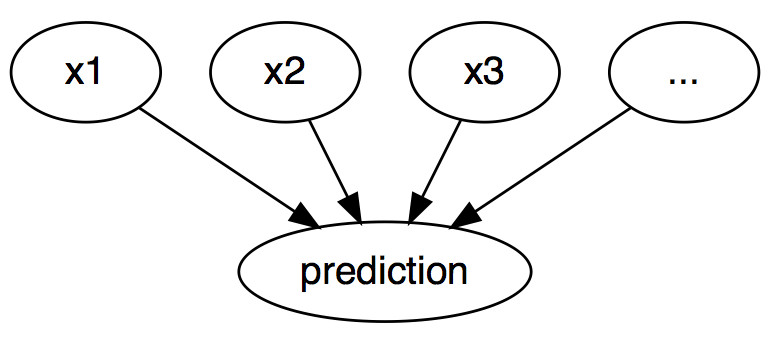
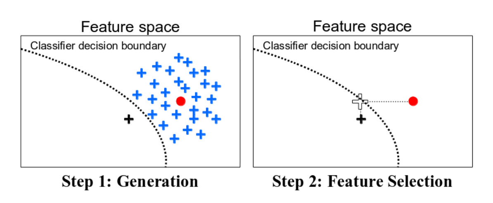

<!--{pagebreak}-->

## Explicaciones contrafácticas {#contrafactual}

```{r, message = FALSE, warning = FALSE, echo = FALSE}
devtools::load_all()
set.seed(42)
```

Una explicación contrafáctica describe una situación causal en la forma: "Si X no hubiera ocurrido, Y no habría ocurrido".
Por ejemplo: "Si no hubiera tomado un sorbo de este café caliente, no me habría quemado la lengua".
El evento Y es que me quemé la lengua;
porque X es que tomé un café caliente.
Pensar en contrafácticas requiere imaginar una realidad hipotética que contradiga los hechos observados (por ejemplo, un mundo en el que no he bebido el café caliente), de ahí el nombre de "contrafáctico".
La capacidad de pensar en contrafáctico nos hace humanos tan inteligentes en comparación con otros animales.

En el aprendizaje automático interpretable, se pueden usar explicaciones contrafácticas para explicar las predicciones de instancias individuales.
El "evento" es el resultado predicho de una instancia, las "causas" son los valores de características particulares de esta instancia que se introdujeron en el modelo y "causaron" cierta predicción.
Mostrada como un gráfico, la relación entre las entradas y la predicción es muy simple:
Los valores de las características causan la predicción.

```{r ml-graph-cf, fig.cap = "Las relaciones causales entre las entradas de un modelo de aprendizaje automático y las predicciones, cuando el modelo se ve simplemente como una caja negra. Las entradas causan la predicción (no necesariamente refleja la relación causal real de los datos).", out.width=500}

```

Incluso si en realidad la relación entre las entradas y el resultado a predecir podría no ser causal, podemos ver las entradas de un modelo como la causa de la predicción.

Dado este simple gráfico, es fácil ver cómo podemos simular contrafácticas para predicciones de modelos de aprendizaje automático:
Simplemente cambiamos los valores de las características de una instancia antes de hacer las predicciones y analizamos cómo cambia la predicción.
Estamos interesados en escenarios en los que la predicción cambia de manera relevante, como un cambio en la clase pronosticada (por ejemplo, solicitud de crédito aceptada o rechazada) o en la que la predicción alcanza un cierto umbral (por ejemplo, la probabilidad de cáncer alcanza el 10%).
**Una explicación contrafáctica de una predicción describe el cambio más pequeño en los valores de la característica que cambia la predicción a una salida predefinida.**

El método de explicación contrafáctico es independiente del modelo, ya que solo funciona con las entradas y salidas del modelo.
Este método también se sentiría como en casa en el [capítulo de modelos agnósticos](#agnostico), ya que la interpretación puede expresarse como un resumen de las diferencias en los valores de las características ("cambiar las características A y B para cambiar la predicción").
Pero una explicación contrafáctica es en sí misma una nueva instancia, por lo que vive en este capítulo ("a partir de la instancia X, cambie A y B para obtener una instancia contrafáctica").
A diferencia de [prototipos](#proto), los contrafácticos no tienen que ser instancias reales de los datos de entrenamiento, sino que pueden ser una nueva combinación de valores de características.

Antes de discutir cómo crear contrafácticos, me gustaría discutir algunos casos de uso para contrafácticos y cómo se ve una buena explicación contrafáctica.

En este primer ejemplo, Pedro solicita un préstamo y es rechazado por el software bancario (con tecnología de aprendizaje automático).
Se pregunta por qué se rechazó su solicitud y cómo podría mejorar sus posibilidades de obtener un préstamo.
La pregunta de "por qué" puede formularse como contrafáctico:
¿Cuál es el cambio más pequeño en las características (ingresos, número de tarjetas de crédito, edad, ...) que cambiarían la predicción de rechazado a aprobado?
Una posible respuesta podría ser:
Si Pedro ganara 10.000 euros más por año, obtendría el préstamo.
O si Pedro tuviera menos tarjetas de crédito y no hubiera incumplido un préstamo hace 5 años, obtendría el préstamo.
Pedro nunca sabrá los motivos del rechazo, ya que el banco no tiene interés en la transparencia, pero esa es otra historia.

En nuestro segundo ejemplo, queremos explicar un modelo que predice un resultado continuo con explicaciones contrafácticas.
Anna quiere alquilar su apartamento, pero no está segura de cuánto cobrar por él, por lo que decide entrenar un modelo de aprendizaje automático para predecir el alquiler.
Por supuesto, dado que Anna es científica de datos, así es como resuelve sus problemas.
Después de ingresar todos los detalles sobre el tamaño, la ubicación, si se permiten mascotas, etc., el modelo le dice que puede cobrar 900 euros.
Esperaba 1000 euros o más, pero confía en su modelo y decide jugar con los valores característicos del apartamento para ver cómo puede mejorar el valor del apartamento.
Ella descubre que el apartamento podría alquilarse por más de 1000 euros, si fuera 15 m^2^ más grande.
Conocimiento interesante, pero no procesable, porque no puede ampliar su departamento.
Finalmente, al ajustar solo los valores de las características bajo su control (cocina incorporada sí / no, mascotas permitidas sí / no, tipo de piso, etc.), descubre que si permite mascotas e instala ventanas con mejor aislamiento, puede cobrar 1000 euros.
Anna había trabajado intuitivamente con los contrafácticos para cambiar el resultado.

Los contrafácticos son [explicaciones amigables para los humanos](#buenaexplicación), porque son contrastantes con la instancia actual y porque son selectivos, lo que significa que generalmente se centran en un pequeño número de cambios de características.
Pero los contrafácticos sufren el 'efecto Rashomon'.
Rashomon es una película japonesa en la que diferentes personas cuentan el asesinato de un samurai.
Cada una de las historias explica el resultado igualmente bien, pero las historias se contradicen entre sí.
Lo mismo también puede suceder con los contrafácticos, ya que generalmente hay múltiples explicaciones contrafácticas diferentes.
Cada contrafáctico cuenta una "historia" diferente de cómo se alcanzó cierto resultado.
Un contrafáctico podría decir que cambie la característica A, el otro contrafáctico podría decir que deje a A igual pero cambie la característica B, lo cual es una contradicción.
Este problema de las verdades múltiples puede abordarse ya sea informando todas las explicaciones contrafácticas o teniendo un criterio para evaluar las contrafácticas y seleccionar la mejor.

Hablando de criterios, ¿cómo definimos una buena explicación contrafáctica?
Primero, el usuario de una explicación contrafáctica define un cambio relevante en la predicción de una instancia (= la realidad alternativa), por lo que un primer requisito obvio es que **una instancia contrafáctica produce la predicción predefinida lo más cerca posible**.
No siempre es posible hacer coincidir exactamente la salida predefinida.
En un entorno de clasificación con dos clases, una clase rara y una clase frecuente, el modelo siempre podría clasificar una instancia como la clase frecuente.
Cambiar los valores de entidad para que la etiqueta predicha cambie de la clase común a la clase rara podría ser imposible.
Por lo tanto, queremos relajar el requisito de que el resultado predicho del contrafáctico debe corresponder exactamente al resultado definido.
En el ejemplo de clasificación, podríamos buscar un contrafáctico en el que la probabilidad predicha de la clase rara se incremente al 10% en lugar del 2% actual.
La pregunta es, ¿cuáles son los cambios mínimos en las características para que la probabilidad pronosticada cambie del 2% al 10% (o cerca del 10%)?
Otro criterio de calidad es que **un contrafáctico debe ser lo más similar posible a la instancia con respecto a los valores de características**.
Esto requiere una medida de distancia entre dos instancias.
El contrafáctico no solo debe estar cerca de la instancia original, sino que también debe **cambiar la menor cantidad de características posible**.
Esto se puede lograr seleccionando una medida de distancia apropiada, como la distancia de Manhattan.
El último requisito es que **una instancia contrafáctica debe tener valores de características que probablemente**.
No tendría sentido generar una explicación contrafáctica para el ejemplo de alquiler donde el tamaño de un apartamento es negativo o el número de habitaciones se establece en 200.
Es incluso mejor cuando el contrafáctico es probable de acuerdo con la distribución conjunta de los datos, por ejemplo un apartamento con 10 habitaciones y 20 m^2^ no debe considerarse una explicación contrafáctica.

### Generando explicaciones contrafácticas

Un enfoque simple e ingenuo para generar explicaciones contrafácticas es buscar por ensayo y error.
Este enfoque implica cambiar aleatoriamente los valores de las características de la instancia de interés y detenerse cuando se predice la salida deseada.
Como el ejemplo en el que Anna trató de encontrar una versión de su departamento por la cual pudiera cobrar más renta.
Pero hay mejores enfoques que prueba y error.
Primero, definimos una función de pérdida que toma como entrada la instancia de interés, un resultado contrafáctico y el resultado deseado (contrafáctico).
La pérdida mide qué tan lejos está el resultado predicho del contrafáctico del resultado predefinido y qué tan lejos está el contrafáctico de la instancia de interés.
Podemos optimizar la pérdida directamente con un algoritmo de optimización o buscando alrededor de la instancia, como se sugiere en el método "Growing Spheres" (consulte [Software y alternativas](#ejemplo-software)).

En esta sección, presentaré el enfoque sugerido por Wachter et. al (2017)[^wachter].
Sugieren minimizar la siguiente pérdida.


$$L(x,x^\prime,y^\prime,\lambda)=\lambda\cdot(\hat{f}(x^\prime)-y^\prime)^2+d(x,x^\prime)$$

El primer término es la distancia cuadrática entre la predicción del modelo para el contrafáctico x 'y el resultado deseado y', que el usuario debe definir de antemano.
El segundo término es la distancia d entre la instancia x que se explicará y la contrafáctica x ', pero más sobre esto más adelante.
El parámetro $\lambda$ equilibra la distancia en predicción (primer término) contra la distancia en valores de características (segundo término).
La pérdida se resuelve para un $\lambda$ dado y devuelve un x' contrafáctico.
Un valor más alto de $\lambda$ significa que preferimos los contrafácticos que se acercan al resultado deseado y', un valor más bajo significa que preferimos los contrafácticos x' que son muy similares a x en los valores de la característica.
Si $\lambda$ es muy grande, se seleccionará la instancia con la predicción más cercana a y', independientemente de qué tan lejos esté de x.
Finalmente, el usuario debe decidir cómo equilibrar el requisito de que la predicción para el contrafáctico coincida con el resultado deseado con el requisito de que el contrafáctico es similar a x.
Los autores del método sugieren en lugar de seleccionar un valor para $\lambda$ para seleccionar una tolerancia $\epsilon$ para la distancia a la que se permite la predicción de la instancia contrafáctica de y'.
Esta restricción se puede escribir como:

$$|\hat{f}(x^\prime)-y^\prime|\leq\epsilon$$

Para minimizar esta función de pérdida, se puede usar cualquier algoritmo de optimización adecuado, por ejemplo Nelder-Mead.
Si tienes acceso a los gradientes del modelo de aprendizaje automático, puedes utilizar métodos basados en gradientes como ADAM.
La instancia x que se explicará, la salida deseada y' y el parámetro de tolerancia $\epsilon$ se deben establecer de antemano.
La función de pérdida se minimiza para x' y la contrafáctica óptima (localmente) x' se devuelve al aumentar $\lambda$ hasta que se encuentre una solución suficientemente cercana (= dentro del parámetro de tolerancia).

$$\arg\min_{x^\prime}\max_{\lambda}L(x,x^\prime,y^\prime,\lambda)$$

La función d para medir la distancia entre la instancia x y la contrafáctica x' es la característica de distancia ponderada de Manhattan con la desviación absoluta media inversa (MAD).

$$d(x,x^\prime)=\sum_{j=1}^p\frac{|x_j-x^\prime_j|}{MAD_j}$$

La distancia total es la suma de todas las distancias p en función de las características, es decir, las diferencias absolutas de los valores de características entre la instancia x y la contrafáctica x'.
Las distancias en función de las características se escalan mediante la inversa de la desviación absoluta media de la característica j sobre el conjunto de datos definido como:


$$MAD_j=\text{median}_{i\in{}\{1,\ldots,n\}}(|x_{i,j}-\text{median}_{l\in{}\{1,\ldots,n\}}(x_{l,j})|)$$

La mediana de un vector es el valor en el que la mitad de los valores del vector son mayores y la otra mitad es menor.
El MAD es el equivalente de la varianza de una entidad, pero en lugar de usar la media como el centro y sumar sobre las distancias cuadradas, usamos la mediana como el centro y la suma sobre las distancias absolutas.
La función de distancia propuesta tiene la ventaja sobre la distancia euclidiana de que introduce escasez.
Esto significa que dos puntos están más cerca uno del otro cuando menos características son diferentes.
Y es más robusto para los valores atípicos.
Es necesario escalar con MAD para llevar todas las características a la misma escala; no importa si mide el tamaño de un apartamento en metros cuadrados o pies cuadrados.

La receta para producir los contrafácticos es simple:

1. Selecciona una instancia x para explicar, el resultado deseado y', una tolerancia $\epsilon$ y un valor inicial (bajo) para $\lambda$.
1. Muestrea una instancia aleatoria como contrafáctico inicial.
1. Optimiza la pérdida con el contrafáctico muestreado inicialmente como punto de partida.
1. Mientras $|\hat{f}(x^\prime)-y^\prime|>\epsilon$::
	- Aumenta $\lambda$.
	- Optimiza la pérdida con el contrafáctico actual como punto de partida.
	- Devuelve el contrafáctico que minimiza la pérdida.
1. Repite los pasos 2 a 4 y devuelva la lista de contrafácticos o la que minimiza la pérdida.

### Ejemplos

Ambos ejemplos son del trabajo de Wachter et. al (2017).

En el primer ejemplo, los autores entrenan una red neuronal totalmente conectada de tres capas para predecir la calificación promedio de un estudiante del primer año en la facultad de derecho, con base en el promedio de calificaciones (GPA) antes del examen de ingreso a la facultad de derecho, la raza y las puntuaciones en el examen.
El objetivo es encontrar explicaciones contrafácticas para cada estudiante que respondan a la siguiente pregunta:
¿Cómo deberían cambiarse las características de entrada para obtener una puntuación prevista de 0?
Como los puntajes se han normalizado anteriormente, un estudiante con un puntaje de 0 es tan bueno como el promedio de los estudiantes.
Un puntaje negativo significa un resultado por debajo del promedio, un puntaje positivo un resultado por encima del promedio.

La siguiente tabla muestra los contrafácticos aprendidos:

| Score | GPA | LSAT | Race | GPA x' | LSAT x' |  Race x'|
| ------|--------------| --------------| --------------| -------| --------| ------- |
| 0.17 | 3.1 | 39.0 | 0 | 3.1 | 34.0 | 0|
| 0.54 | 3.7 | 48.0 | 0 | 3.7 | 32.4 | 0|
| -0.77| 3.3 | 28.0 | 1 | 3.3 | 33.5 | 0|
| -0.83| 2.4 | 28.5 | 1 | 2.4 | 35.8 | 0|
| -0.57| 2.7 | 18.3 | 0 | 2.7 | 34.9 | 0|

La primera columna contiene la puntuación pronosticada, las siguientes 3 columnas los valores de características originales y las últimas 3 columnas los valores de características contrafácticos que dan como resultado una puntuación cercana a 0.
Las primeras dos filas son estudiantes con predicciones superiores al promedio, las otras tres filas inferiores al promedio.
Los contrafácticos para las dos primeras filas describen cómo las características del estudiante tendrían que cambiar para disminuir la puntuación prevista y para los otros tres casos cómo tendrían que cambiar para aumentar la puntuación al promedio.
Los contrafácticos para aumentar el puntaje siempre cambian la raza de negro (codificado con 1) a blanco (codificado con 0), lo que muestra un sesgo racial del modelo.
El GPA no se cambia en los contrafácticos, pero sí LSAT.

El segundo ejemplo muestra explicaciones contrafácticas para el riesgo predicho de diabetes.
Una red neuronal totalmente conectada de tres capas está entrenada para predecir el riesgo de diabetes según la edad, el IMC, el número de embarazos, etc. para las mujeres de ascendencia Pima.
Los contrafácticos responden a la pregunta: ¿Qué valores de las características deben cambiarse para aumentar o disminuir la puntuación de riesgo de diabetes a 0.5?
Se encontraron los siguientes contrafácticos:

- Persona 1: si su nivel de insulina en suero a las 2 horas fuera 154.3, tendría una puntuación de 0.51
- Persona 2: si su nivel de insulina en suero a las 2 horas fuera 169.5, tendría un puntaje de 0.51
- Persona 3: si su concentración de glucosa en plasma fuera 158.3 y su nivel de insulina sérica a las 2 horas fuera 160.5, tendría un puntaje de 0.51


### Ventajas

**La interpretación de las explicaciones contrafácticas es muy clara**.
Si los valores de característica de una instancia se cambian de acuerdo con el contrafáctico, la predicción cambia a la predicción predefinida.
No hay suposiciones adicionales ni magia en el fondo.
Esto también significa que no es tan peligroso como métodos como [LIME](#lime), donde no está claro hasta qué punto podemos extrapolar el modelo local para la interpretación.

El método contrafáctico crea una nueva instancia, pero también podemos resumir un contrafáctico al informar qué valores de características han cambiado.
Esto nos da **dos opciones para informar nuestros resultados**.
Puedes informar la instancia contrafáctica o resaltar qué características se han cambiado entre la instancia de interés y la instancia contrafáctica.

El **método contrafáctico no requiere acceso a los datos o al modelo**.
Solo requiere acceso a la función de predicción del modelo, que también funcionaría a través de una API web, por ejemplo.
Esto es atractivo para las empresas que son auditadas por terceros o que ofrecen explicaciones a los usuarios sin revelar el modelo o los datos.
Una empresa tiene interés en proteger el modelo y los datos debido a secretos comerciales o razones de protección de datos.
Las explicaciones contrafácticas ofrecen un equilibrio entre explicar las predicciones del modelo y proteger los intereses del propietario del modelo.

El método **también funciona con sistemas que no utilizan aprendizaje automático**.
Podemos crear contrafácticos para cualquier sistema que reciba entradas y devuelva salidas.
El sistema que predice alquileres de apartamentos también podría consistir en reglas escritas a mano, y las explicaciones contrafácticas seguirían funcionando.

**El método de explicación contrafáctico es relativamente fácil de implementar**, ya que es esencialmente una función de pérdida que se puede optimizar con bibliotecas estándar.
Se deben tener en cuenta algunos detalles adicionales, como limitar los valores de las características a rangos significativos (por ejemplo, solo tamaños de apartamentos positivos).

### Desventajas

**Para cada caso, generalmente encontrará múltiples explicaciones contrafácticas (efecto Rashomon)**.
Esto es inconveniente: la mayoría de las personas prefieren explicaciones simples sobre la complejidad del mundo real.
También es un desafío práctico.
Digamos que generamos 23 explicaciones contrafácticas para una instancia.
¿Los estamos informando a todos?
¿Solo lo mejor?
¿Qué pasa si todos son relativamente "buenos", pero muy diferentes?
Estas preguntas deben ser respondidas de nuevo para cada proyecto.
También puede ser ventajoso tener múltiples explicaciones contrafácticas, porque entonces los humanos pueden seleccionar las que corresponden a sus conocimientos previos.

**No hay garantía de que para una tolerancia dada $\epsilon$ se encuentre una instancia contrafáctica**.
Eso no es necesariamente culpa del método, sino que depende de los datos.

El método propuesto **no maneja características categóricas** con muchos niveles diferentes bien.
Los autores del método sugirieron ejecutar el método por separado para cada combinación de valores de características de las características categóricas, pero esto conducirá a una explosión combinatoria si tiene múltiples características categóricas con muchos valores.
Por ejemplo, 6 características categóricas con 10 niveles únicos significarían 1 millón de ejecuciones.
Martens et. al (2014) Propusieron una solución solo para características categóricas[^martens].
En el paquete Python [Alibi](https://docs.seldon.io/projects/alibi/en/stable/methods/CFProto) se implementa una solución que maneja variables numéricas y categóricas con una forma de principio de generar perturbaciones para variables categóricas. .html).

### Software y alternativas {#ejemplo-software}

Las explicaciones contrafácticas se implementan en el paquete Python [Alibi](https://github.com/SeldonIO/alibi). Los autores del paquete implementan un [método contrafáctico simple](https://docs.seldon.io/projects/alibi/en/stable/methods/CF.html) así como un [método extendido](https://docs.seldon.io/projects/alibi/en/stable/methods/CFProto.html) que utiliza prototipos de clase para mejorar la interpretabilidad y la convergencia de las salidas del algoritmo[^vanlooveren].

Martens et. al (2014) Propusieron un enfoque muy similar. al para explicar las clasificaciones de documentos.
En su trabajo, se enfocan en explicar por qué un documento fue o no clasificado como una clase en particular.
La diferencia con el método presentado en este capítulo es que Martens et. al (2014) se centran en clasificadores de texto, que tienen apariciones de palabras como entradas.

Una forma alternativa de buscar datos contrafácticos es el algoritmo Growing Spheres de Laugel et. al (2017)[^spheres].
El método primero dibuja una esfera alrededor del punto de interés, muestrea puntos dentro de esa esfera, verifica si uno de los puntos muestreados produce la predicción deseada, contrae o expande la esfera en consecuencia hasta que se encuentra un contrafáctico (escaso) y finalmente se devuelve.
No usan la palabra contrafáctico en su trabajo, pero el método es bastante similar.
También definen una función de pérdida que favorece los contrafácticos con el menor número posible de cambios en los valores de las características.
En lugar de optimizar directamente la función, sugieren la búsqueda mencionada anteriormente con esferas.

```{r counterfactuals-spheres, fig.cap = "Una ilustración de Growing Spheres y seleccionando contrafácticos dispersos de Laugel et. al (2017).", out.width = 500}

```

Las anclas son lo opuesto a los contrafácticos.
Las anclas responden la pregunta:
¿Qué características son suficientes para anclar una predicción, es decir, cambiar las otras características no puede cambiar la predicción?
Una vez que hayamos encontrado características que sirven como anclajes para una predicción, ya no encontraremos instancias contrafácticas cambiando las características no utilizadas en el ancla.

```{r counterfactual-anchors, fig.cap = "Ejemplos de anclajes de Ribeiro et. al (2018).", out.width = 500}
knitr::include_graphics("images/anchors.jpg")
```

[^martens]: Martens, David, and Foster Provost. "Explaining data-driven document classifications." (2014).

[^anchors]: Ribeiro, Marco Tulio, Sameer Singh, and Carlos Guestrin. "Anchors: High-precision model-agnostic explanations." AAAI Conference on Artificial Intelligence (2018).

[^spheres]: Laugel, Thibault, et al. "Inverse classification for comparison-based interpretability in machine learning." arXiv preprint arXiv:1712.08443 (2017).

[^wachter]: Wachter, Sandra, Brent Mittelstadt, and Chris Russell. "Counterfactual explanations without opening the black box: Automated decisions and the GDPR." (2017).

[^vanlooveren]: Van Looveren, Arnaud, and Janis Klaise. "Interpretable Counterfactual Explanations Guided by Prototypes."  arXiv preprint arXiv:1907.02584 (2019).
