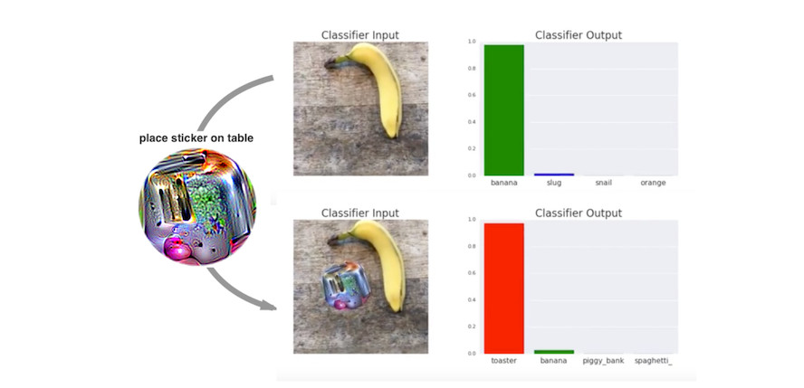

```{r, message = FALSE, warning = FALSE, echo = FALSE}
devtools::load_all()
set.seed(42)
```

<!--{pagebreak}-->

## Ejemplos adversos {#adversarial}

Un ejemplo adverso es una instancia con pequeñas perturbaciones de características intencionales que hacen que un modelo de aprendizaje automático haga una predicción falsa.
Recomiendo leer el capítulo sobre [Explicaciones contrafácticas](#contrafactual) primero, ya que los conceptos son muy similares.
Los ejemplos adversos son ejemplos contrafácticos con el objetivo de engañar al modelo, no interpretarlo.

<!-- *Palabras clave: ejemplos adversos, aprendizaje automático adversario, contrafácticos, ataques de evasión, seguridad de aprendizaje automático* -->

¿Por qué nos interesan los ejemplos adversos?
¿No son solo subproductos curiosos de los modelos de aprendizaje automático sin relevancia práctica?
La respuesta es un claro "no".
Los ejemplos adversos hacen que los modelos de aprendizaje automático sean vulnerables a los ataques, como en los siguientes escenarios.

Un auto sin conductor choca con otro porque ignora una señal de alto.
Alguien había colocado una imagen sobre el letrero, que parece una señal de alto con un poco de suciedad para los humanos, pero fue diseñado para parecerse a un letrero de prohibición de estacionamiento para el software de reconocimiento de letreros del automóvil.

Un detector de spam no puede clasificar un correo electrónico como spam.
El correo no deseado ha sido diseñado para parecerse a un correo electrónico normal, pero con la intención de engañar al destinatario.

Un escáner automático de aprendizaje automático escanea las maletas en busca de armas en el aeropuerto.
Se desarrolló un cuchillo para evitar la detección al hacer que el sistema piense que es un paraguas.

Echemos un vistazo a algunas formas de crear ejemplos adversos.

### Métodos y ejemplos

Existen muchas técnicas para crear ejemplos adversos.
La mayoría de los enfoques sugieren minimizar la distancia entre el ejemplo de confrontación y la instancia a manipular, mientras se cambia la predicción al resultado deseado (de confrontación).
Algunos métodos requieren acceso a los gradientes del modelo, que por supuesto solo funciona con modelos basados en gradientes como las redes neuronales, otros métodos solo requieren acceso a la función de predicción, lo que hace que estos métodos sean independientes del modelo.
Los métodos de esta sección se centran en clasificadores de imágenes con redes neuronales profundas, ya que se realiza mucha investigación en esta área y la visualización de imágenes adversas es muy educativa.
Ejemplos adversos de imágenes son imágenes con píxeles intencionalmente perturbados con el objetivo de engañar al modelo durante el tiempo de aplicación.
Los ejemplos demuestran de manera impresionante la facilidad con que las redes neuronales profundas para el reconocimiento de objetos pueden ser engañadas por imágenes que parecen inofensivas para los humanos.
Si aún no has visto estos ejemplos, puedes sorprenderte, porque los cambios en las predicciones son incomprensibles para un observador humano.
Los ejemplos adversos son como ilusiones ópticas pero para máquinas.

**Algo está mal con mi perro**

Szegedy et. al (2013)[^szegedy] utilizó un enfoque de optimización basado en gradiente en su trabajo "Propiedades intrigantes de las redes neuronales" para encontrar ejemplos adversos para redes neuronales profundas.

```{r adversarial-ostrich, fig.cap = "Ejemplos adversos para AlexNet de Szegedy et. al (2013). Todas las imágenes en la columna izquierda están clasificadas correctamente. La columna central muestra el error (ampliado) agregado a las imágenes para producir las imágenes en la columna derecha, todas clasificadas (incorrectamente) como 'Avestruz'.", out.width = 600}
knitr::include_graphics("images/adversarial-ostrich.jpg")
```

Estos ejemplos adversos se generaron minimizando la siguiente función con respecto a r:

$$loss(\hat{f}(x+r),l)+c\cdot|r|$$

En esta fórmula, x es una imagen (representada como un vector de píxeles), r son los cambios en los píxeles para crear una imagen de confrontación (x + r produce una nueva imagen), l es la clase de resultado deseada y el parámetro c se usa para equilibrar la distancia entre imágenes y la distancia entre predicciones.
El primer término es la distancia entre el resultado predicho del ejemplo de confrontación y la clase deseada l, el segundo término mide la distancia entre el ejemplo de confrontación y la imagen original.
Esta formulación es casi idéntica a la función de pérdida para generar [explicaciones contrafácticas](#contrafactual).
Existen restricciones adicionales para r, de modo que los valores de píxeles permanecen entre 0 y 1.
Los autores sugieren resolver este problema de optimización con un L-BFGS con restricción de caja, un algoritmo de optimización que funciona con gradientes.

**Panda perturbado: método de signo de gradiente rápido**

Goodfellow et. al (2014)[^goodfellow] inventaron el método de signo de gradiente rápido para generar imágenes adversas.
El método de signo de gradiente usa el gradiente del modelo subyacente para encontrar ejemplos adversos.
La imagen original x se manipula agregando o restando un pequeño error $\epsilon$ a cada píxel.
Si sumamos o restamos $\epsilon$ depende de si el signo del gradiente de un píxel es positivo o negativo.
Agregar errores en la dirección del gradiente significa que la imagen se altera intencionalmente para que la clasificación del modelo falle.


```{r adversarial-panda, fig.cap = "Goodfellow et. al (2014) hacen que un panda se vea como un gibón para una red neuronal. Al agregar pequeñas perturbaciones (imagen central) a los píxeles originales del panda (imagen izquierda), los autores crean un ejemplo de confrontación que se clasifica como un gibón (imagen de la derecha) pero parece un panda para los humanos.", out.width = 600}

```


La siguiente fórmula describe el núcleo del método de signo de gradiente rápido:

$$x^\prime=x+\epsilon\cdot{}sign(\bigtriangledown_x{}J(\theta,x,y))$$


donde $\bigtriangledown_x{}J$ es el gradiente de la función de pérdida de modelos con respecto al vector de píxeles de entrada original x, y es el verdadero vector de etiqueta para x y $\theta$ es el vector de parámetros del modelo.
Del vector de gradiente (que es tan largo como el vector de los píxeles de entrada) solo necesitamos el signo:
El signo del gradiente es positivo (+1) si un aumento en la intensidad de píxeles aumenta la pérdida (el error que comete el modelo) y negativo (-1) si una disminución en la intensidad de píxeles aumenta la pérdida.
Esta vulnerabilidad se produce cuando una red neuronal trata una relación entre una intensidad de píxel de entrada y la puntuación de la clase de forma lineal.
En particular, las arquitecturas de redes neuronales que favorecen la linealidad, como LSTM, redes maxout, redes con unidades de activación ReLU u otros algoritmos lineales de aprendizaje automático, como la regresión logística, son vulnerables al método de signo de gradiente.
El ataque se lleva a cabo por extrapolación.
La linealidad entre la intensidad del píxel de entrada y los puntajes de la clase conduce a la vulnerabilidad a los valores atípicos, es decir, el modelo puede ser engañado moviendo los valores de los píxeles a áreas fuera de la distribución de datos.
Se esperaba que estos ejemplos adversos fueran bastante específicos para una arquitectura de red neuronal dada.
Pero resulta que puedes reutilizar ejemplos adversos para engañar a las redes con una arquitectura diferente entrenada en la misma tarea.

Goodfellow et. al (2014) sugirieron agregar ejemplos adversos a los datos de entrenamiento para aprender modelos robustos.


**Una medusa ... No, espera. Una bañera: ataques de 1 píxel**

El enfoque presentado por Goodfellow y colegas (2014) requiere que se cambien muchos píxeles, aunque solo sea un poco.
Pero, ¿y si solo puedes cambiar un solo píxel?
¿Serías capaz de engañar a un modelo de aprendizaje automático?
Su et al. (2019)[^1pixel] demostraron que en realidad es posible engañar a los clasificadores de imágenes cambiando un solo píxel.

```{r adversarial-1pixel, fig.cap = "Al cambiar intencionalmente un solo píxel (marcado con círculos), una red neuronal entrenada en ImageNet es engañada para predecir la clase incorrecta en lugar de la clase original. Trabajo de Su et. al (2019).", out.width = 600}

```

De manera similar a los contrafácticos, el ataque de 1 píxel busca un ejemplo modificado de x' que se acerque a la imagen original x, pero cambie la predicción a un resultado adverso.
Sin embargo, la definición de cercanía difiere: solo un píxel puede cambiar.
El ataque de 1 píxel utiliza la evolución diferencial para descubrir qué píxel se va a cambiar y cómo.
La evolución diferencial se inspira libremente en la evolución biológica de las especies.
Una población de individuos llamados soluciones candidatas se recombina generación por generación hasta encontrar una solución.
Cada solución candidata codifica una modificación de píxeles y está representada por un vector de cinco elementos: las coordenadas x e y y los valores rojo, verde y azul (RGB).
La búsqueda comienza con, por ejemplo, 400 soluciones candidatas (= sugerencias de modificación de píxeles) y crea una nueva generación de soluciones candidatas (secundarias) a partir de la generación principal utilizando la siguiente fórmula:

$$x_{i}(g+1)=x_{r1}(g)+F\cdot(x_{r2}(g)+x_{r3}(g))$$

donde cada $x_i$ es un elemento de una solución candidata (ya sea coordenada x, coordenada y, rojo, verde o azul), g es la generación actual, F es un parámetro de escala (establecido en 0.5) y r1, r2 y r3 son números aleatorios diferentes.
Cada nueva solución candidata secundaria es a su vez un píxel con los cinco atributos de ubicación y color y cada uno de esos atributos es una mezcla de tres píxeles primarios aleatorios.

La creación de elementos secundarios se detiene si una de las soluciones candidatas es un ejemplo contradictorio, lo que significa que se clasifica como una clase incorrecta o si se alcanza el número de iteraciones máximas especificadas por el usuario.


**Todo es una tostadora: parche adversarial**

Uno de mis métodos favoritos trae ejemplos adversos a la realidad física.
Brown et. al (2017)[^toaster] diseñaron una etiqueta imprimible que se puede pegar junto a los objetos para que parezcan tostadoras para un clasificador de imágenes.
Trabajo brillante!

```{r adversarial-toaster, fig.cap = "Una calcomanía que hace que un clasificador VGG16 entrenado en ImageNet clasifique una imagen de un plátano como tostadora. Trabajo de Brown et. al (2017).", out.width = 600}

```

Este método difiere de los métodos presentados hasta ahora para los ejemplos de confrontación, ya que se elimina la restricción de que la imagen de confrontación debe estar muy cerca de la imagen original.
En cambio, el método reemplaza completamente una parte de la imagen con un parche que puede tomar cualquier forma.
La imagen del parche se optimiza sobre diferentes imágenes de fondo, con diferentes posiciones del parche en las imágenes, a veces movidas, a veces más grandes o más pequeñas y giradas, para que el parche funcione en muchas situaciones.
Al final, esta imagen optimizada puede imprimirse y usarse para engañar a los clasificadores de imágenes en la naturaleza.


**Nunca traigas una tortuga impresa en 3D a un tiroteo, incluso si tu computadora cree que es una buena idea: ejemplos adversos robustos**

El siguiente método es literalmente agregar otra dimensión a la tostadora:
Athalye et. al (2017)[^turtle] imprimieron en 3D una tortuga que fue diseñada para parecerse a un rifle en una red neuronal profunda desde casi todos los ángulos posibles.
Sí, leíste eso bien.
¡Un objeto físico que parece una tortuga para los humanos parece un rifle para la computadora!

```{r adversarial-turtle, fig.cap = "Una tortuga impresa en 3D que es reconocida como un rifle por el clasificador InceptionV3 pre-entrenado estándar de TensorFlow. Trabajo de Athalye et. al (2017)", out.width = 600}
knitr::include_graphics("images/adversarial-turtle.jpg")
```

Los autores han encontrado una manera de crear un ejemplo de confrontación en 3D para un clasificador 2D que es adversario sobre las transformaciones, como todas las posibilidades de rotar a la tortuga, acercar, etc.
Otros enfoques, como el método de gradiente rápido, ya no funcionan cuando se gira la imagen o cambian los ángulos de visión.
Athalye et. al (2017) proponen el algoritmo Expectation Over Transformation (EOT), que es un método para generar ejemplos adversos que incluso funcionan cuando la imagen se transforma.
La idea principal detrás de EOT es optimizar ejemplos adversos en muchas transformaciones posibles.
En lugar de minimizar la distancia entre el ejemplo de confrontación y la imagen original, EOT mantiene la distancia esperada entre los dos por debajo de un cierto umbral, dada una distribución seleccionada de posibles transformaciones.
La distancia esperada bajo transformación se puede escribir como:

$$\mathbb{E}_{t\sim{}T}[d(t(x^\prime),t(x))]$$

donde x es la imagen original, t(x) la imagen transformada (por ejemplo, rotada), x' el ejemplo de confrontación y t(x') su versión transformada.
Además de trabajar con una distribución de transformaciones, el método EOT sigue el patrón familiar de enmarcar la búsqueda de ejemplos adversos como un problema de optimización.
Intentamos encontrar un ejemplo de confrontación x' que maximice la probabilidad de la clase seleccionada $y_t$ (por ejemplo, "rifle") en la distribución de posibles transformaciones T:

$$\arg\max_{x^\prime}\mathbb{E}_{t\sim{}T}[log{}P(y_t|t(x^\prime))]$$

Con la restricción de que la distancia esperada sobre todas las posibles transformaciones entre el ejemplo de confrontación x' y la imagen original x permanece por debajo de cierto umbral:

$$\mathbb{E}_{t\sim{}T}[d(t(x^\prime),t(x))]<\epsilon\quad\text{and}\quad{}x\in[0,1]^d$$

Creo que deberíamos preocuparnos por las posibilidades que ofrece este método.
Los otros métodos se basan en la manipulación de imágenes digitales.
Sin embargo, estos ejemplos adversos robustos impresos en 3D se pueden insertar en cualquier escena real y engañar a una computadora para clasificar erróneamente un objeto.
Vamos a darle la vuelta: ¿Qué pasa si alguien crea un rifle que se parece a una tortuga?

**El adversario con los ojos vendados: ataque de caja negra**

Imagina el siguiente escenario:
Te doy acceso a mi gran clasificador de imágenes a través de la API web.
Puedes obtener predicciones del modelo, pero no tienes acceso a los parámetros del modelo.
Desde la comodidad de tu sofá, puedes enviar datos y ver mis respuestas de servicio con las clasificaciones correspondientes.
La mayoría de los ataques adversos no están diseñados para funcionar en este escenario porque requieren acceso al gradiente de la red neuronal profunda subyacente para encontrar ejemplos adversos.
Papernot et al. (2017)[^papernot] demostraron que es posible crear ejemplos adversos sin información interna del modelo y sin acceso a los datos de entrenamiento.
Este tipo de ataque (casi) de conocimiento cero se llama ataque de caja negra.

Cómo funciona:

1. Comienza con algunas imágenes que provienen del mismo dominio que los datos de entrenamiento, por ejemplo, si el clasificador a atacar es un clasificador de dígitos, use imágenes de dígitos. Se requiere el conocimiento del dominio, pero no el acceso a los datos de entrenamiento.
1. Obtén predicciones para el conjunto actual de imágenes de caja negra.
1. Entrena a un modelo sustituto en el conjunto actual de imágenes (por ejemplo, una red neuronal).
1. Crea un nuevo conjunto de imágenes sintéticas utilizando una heurística que examine el conjunto actual de imágenes en qué dirección manipular los píxeles para que la salida del modelo tenga más variación.
1. Repite los pasos 2 a 4 para un número predefinido de épocas.
1. Crea ejemplos adversos para el modelo sustituto utilizando el método de gradiente rápido (o similar).
1. Ataca el modelo original con ejemplos adversos.

El objetivo del modelo sustituto es aproximar los límites de decisión del modelo de caja negra, pero no necesariamente para lograr la misma precisión.

Los autores probaron este enfoque atacando clasificadores de imágenes entrenados en varios servicios de aprendizaje automático en la nube.
Estos servicios entrenan a los clasificadores de imágenes en imágenes y etiquetas cargadas por el usuario.
El software entrena el modelo automáticamente, a veces con un algoritmo desconocido para el usuario, y lo implementa.
El clasificador da predicciones para las imágenes cargadas, pero el modelo en sí no puede ser inspeccionado o descargado.
Los autores pudieron encontrar ejemplos adversos para varios proveedores, con hasta el 84% de los ejemplos adversos clasificados erróneamente.

El método incluso funciona si el modelo de caja negra a ser engañado no es una red neuronal.
Esto incluye modelos de aprendizaje automático sin gradientes, como árboles de decisión.

### La perspectiva de ciberseguridad

El aprendizaje automático trata con incógnitas conocidas: prediciendo puntos de datos desconocidos a partir de una distribución conocida.
La defensa contra ataques se ocupa de incógnitas desconocidas: prediciendo de manera sólida puntos de datos desconocidos a partir de una distribución desconocida de entradas adversas.
A medida que el aprendizaje automático se integra en más y más sistemas, como vehículos autónomos o dispositivos médicos, también se están convirtiendo en puntos de entrada para ataques.
Incluso si las predicciones de un modelo de aprendizaje automático en un conjunto de datos de prueba son 100% correctas, se pueden encontrar ejemplos adversos para engañar al modelo.
La defensa de los modelos de aprendizaje automático contra los ciberataques es una nueva parte del campo de la ciberseguridad.

Biggio et. al (2018)[^adversarial] ofrecen una buena revisión de diez años de investigación sobre aprendizaje automático adversarial, en el que se basa esta sección.
La ciberseguridad es una carrera armamentista en la que los atacantes y defensores se burlan mutuamente una y otra vez.


**Hay tres reglas de oro en ciberseguridad: 1) conoce a tu adversario 2) sé proactivo y 3) protégete.**

Las diferentes aplicaciones tienen diferentes adversos.
Las personas que intentan defraudar a otras personas por correo electrónico por su dinero son agentes adversos de los usuarios y proveedores de servicios de correo electrónico.
Los proveedores quieren proteger a sus usuarios para que puedan seguir usando su programa de correo, los atacantes quieren que las personas les den dinero.
Conocer a tus adversos significa conocer sus objetivos.
Suponiendo que no sabes que existen estos spammers y que el único abuso del servicio de correo electrónico es enviar copias pirateadas de música, la defensa sería diferente (por ejemplo, escaneando los archivos adjuntos en busca de material protegido por derechos de autor en lugar de analizar el texto en busca de indicadores de spam).

Ser proactivo significa probar e identificar activamente los puntos débiles del sistema.
Eres proactivo cuando tratas de engañar activamente al modelo con ejemplos adversos y luego te defiendes de ellos.
El uso de métodos de interpretación para comprender qué características son importantes y cómo las características afectan la predicción también es un paso proactivo para comprender las debilidades de un modelo de aprendizaje automático.
Como científico de datos, ¿confías en tu modelo en este mundo peligroso sin haber visto más allá del poder predictivo en un conjunto de datos de prueba?
¿Has analizado cómo se comporta el modelo en diferentes escenarios, identificado las entradas más importantes, verificado las explicaciones de predicción para algunos ejemplos?
¿Has intentado encontrar entradas adversas?
La interpretabilidad de los modelos de aprendizaje automático juega un papel importante en la ciberseguridad.
Ser reactivo, lo opuesto a proactivo, significa esperar hasta que el sistema haya sido atacado y solo entonces comprender el problema e instalar algunas medidas defensivas.

¿Cómo podemos proteger nuestros sistemas de aprendizaje automático contra ejemplos adversos?
Un enfoque proactivo es el reentrenamiento iterativo del clasificador con ejemplos adversos, también llamado entrenamiento adversario.
Otros enfoques se basan en la teoría de juegos, como aprender transformaciones invariables de las características u optimización robusta (regularización).
Otro método propuesto es usar múltiples clasificadores en lugar de uno solo y hacer que voten la predicción (conjunto), pero eso no tiene garantía de funcionar, ya que todos podrían sufrir ejemplos adversos similares.
Otro enfoque que tampoco funciona bien es el enmascaramiento de gradiente, que construye un modelo sin gradientes útiles mediante el uso de un clasificador vecino más cercano en lugar del modelo original.


Podemos distinguir los tipos de ataques según cuánto sepa un atacante sobre el sistema.
Los atacantes pueden tener un conocimiento perfecto (ataque de caja blanca), lo que significa que saben todo sobre el modelo, como el tipo de modelo, los parámetros y los datos de entrenamiento;
los atacantes pueden tener un conocimiento parcial (ataque de caja gris), lo que significa que solo pueden conocer la representación de características y el tipo de modelo que se utilizó, pero no tienen acceso a los datos de entrenamiento o los parámetros;
los atacantes pueden tener cero conocimiento (ataque de caja negra), lo que significa que solo pueden consultar el modelo caja negra pero no tienen acceso a los datos de entrenamiento o información sobre los parámetros del modelo.
Dependiendo del nivel de información, los atacantes pueden usar diferentes técnicas para atacar el modelo.
Como hemos visto en los ejemplos, incluso en el caso de la caja negra se pueden crear ejemplos adversos, de modo que ocultar información sobre los datos y el modelo no es suficiente para protegerse contra los ataques.

Dada la naturaleza del juego del gato y el ratón entre atacantes y defensores, veremos mucho desarrollo e innovación en esta área.
Solo piensa en los diferentes tipos de correos electrónicos no deseados que evolucionan constantemente.
Se inventan nuevos métodos de ataques contra modelos de aprendizaje automático y se proponen nuevas medidas defensivas contra estos nuevos ataques.
Se desarrollan ataques más potentes para evadir las últimas defensas y así sucesivamente hasta el infinito.
Con este capítulo espero sensibilizar sobre el problema de los ejemplos adversos y que solo estudiando proactivamente los modelos de aprendizaje automático podemos descubrir y remediar las debilidades.


[^szegedy]: Szegedy, Christian, et al. "Intriguing properties of neural networks." arXiv preprint arXiv:1312.6199 (2013).

[^adversarial]: Biggio, Battista, and Fabio Roli. "Wild Patterns: Ten years after the rise of adversarial machine learning." Pattern Recognition 84 (2018): 317-331.

[^turtle]: Athalye, Anish, and Ilya Sutskever. "Synthesizing robust adversarial examples." arXiv preprint arXiv:1707.07397 (2017).

[^goodfellow]: Goodfellow, Ian J., Jonathon Shlens, and Christian Szegedy. "Explaining and harnessing adversarial examples." arXiv preprint arXiv:1412.6572  (2014).

[^1pixel]: Su, Jiawei, Danilo Vasconcellos Vargas, and Kouichi Sakurai. "One pixel attack for fooling deep neural networks." IEEE Transactions on Evolutionary Computation (2019).

[^toaster]: Brown, Tom B., et al. "Adversarial patch." arXiv preprint arXiv:1712.09665 (2017).

[^papernot]: Papernot, Nicolas, et al. "Practical black-box attacks against machine learning." Proceedings of the 2017 ACM on Asia Conference on Computer and Communications Security. ACM (2017).
