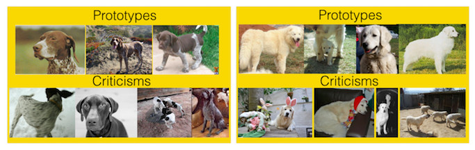
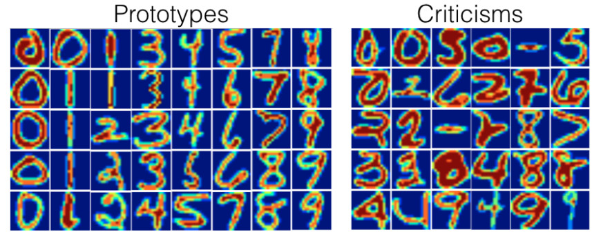

```{r, message = FALSE, warning = FALSE, echo = FALSE}
devtools::load_all()
set.seed(42)
```

<!--{pagebreak}-->

## Prototipos y excepciones {#proto}

Un **prototipo** es una instancia de datos que es representativa de todos los datos.
Una **excepción** es una instancia de datos que no está bien representada por el conjunto de prototipos.
El propósito de una excepción es proporcionar ideas junto con los prototipos, especialmente para los puntos de datos que los prototipos no representan bien.
Los prototipos y excepciones se pueden usar independientemente de un modelo de aprendizaje automático para describir los datos, pero también se pueden usar para crear un modelo interpretable o para hacer que un modelo de caja negra sea interpretable.

En este capítulo utilizo la expresión "punto de datos" para referirme a una sola instancia, para enfatizar la interpretación de que una instancia también es un punto en un sistema de coordenadas donde cada entidad es una dimensión.
La siguiente figura muestra una distribución de datos simulada, con algunas de las instancias elegidas como prototipos y otras como excepciones.
Los puntos pequeños son los datos, los puntos grandes los prototipos y los cuadrados grandes las excepciones.
Los prototipos se seleccionan (manualmente) para cubrir los centros de distribución de datos y las excepciones son puntos en un grupo sin un prototipo.
Los prototipos y excepciones son siempre ejemplos reales de los datos.

```{r, fig.cap = "Prototipos y excepciones para una distribución de datos con dos características x1 y x2."}
set.seed(1)
dat1 = data.frame(x1 = rnorm(20, mean = 4, sd = 0.3), x2 = rnorm(20, mean = 1, sd = 0.3))
dat2 = data.frame(x1 = rnorm(30, mean = 2, sd = 0.2), x2 = rnorm(30, mean = 2, sd = 0.2))
dat3 = data.frame(x1 = rnorm(40, mean = 3, sd = 0.2), x2 = rnorm(40, mean = 3))
dat4 = data.frame(x1 = rnorm(7, mean = 4, sd = 0.1), x2 = rnorm(7, mean = 2.5, sd = 0.1))

dat = rbind(dat1, dat2, dat3, dat4)
dat$type = "data"
dat$type[c(7, 23, 77)] = "prototipo"
dat$type[c(81,95)] = "excepción"

ggplot(dat, aes(x = x1, y = x2)) + geom_point(alpha = 0.7) +
  geom_point(data = filter(dat, type!='data'), aes(shape = type), size = 9, alpha = 1, color = "blue") + 
  scale_shape_manual(breaks = c("prototipo", "excepción"), values = c(18, 19)) 

```

Seleccioné los prototipos manualmente, lo que no escala bien y probablemente conduce a malos resultados.
Hay muchos enfoques para encontrar prototipos en los datos.
Uno de estos es k-medoids, un algoritmo de agrupamiento relacionado con el algoritmo k-means.
Cualquier algoritmo de agrupación que devuelva puntos de datos reales como centros de agrupación calificaría para seleccionar prototipos.
Pero la mayoría de estos métodos solo encuentran prototipos, no excepciones.
Este capítulo presenta MMD-critic por Kim et. al (2016)[^MMDcritic], un enfoque que combina prototipos y excepciones en un solo marco.

MMD-critic compara la distribución de los datos y la distribución de los prototipos seleccionados.
Este es el concepto central para entender el método crítico de MMD-critic.
MMD-critic selecciona prototipos que minimizan la discrepancia entre las dos distribuciones.
Los puntos de datos en áreas con alta densidad son buenos prototipos, especialmente cuando los puntos se seleccionan de diferentes "grupos de datos".
Los puntos de datos de regiones que no están bien explicados por los prototipos se seleccionan como excepciones.

Profundicemos más en la teoría.

### Teoría

El procedimiento de MMD-critic a alto nivel se puede resumir brevemente:

1. Selecciona la cantidad de prototipos y excepciones que deseas encontrar.
1. Encuentra prototipos con greedy search.
Los prototipos se seleccionan de modo que la distribución de los prototipos esté cerca de la distribución de datos.
1. Encuentra excepciones con greedy search.
Los puntos se seleccionan como excepciones donde la distribución de prototipos difiere de la distribución de los datos.

Necesitamos un par de ingredientes para encontrar prototipos y excepciones para un conjunto de datos con MMD-critical.
Como ingrediente más básico, necesitamos una **función del núcleo** para estimar las densidades de datos.
Un núcleo es una función que pesa dos puntos de datos según su proximidad.
En base a las estimaciones de densidad, necesitamos una medida que nos diga cuán diferentes son las dos distribuciones para que podamos determinar si la distribución de los prototipos que seleccionamos está cerca de la distribución de datos.
Esto se resuelve midiendo la **discrepancia media máxima (MMD)**.
También basado en la función del núcleo, necesitamos la **función testigo** para decirnos cuán diferentes son dos distribuciones en un punto de datos particular.
Con la función testigo, podemos seleccionar excepciones, es decir, puntos de datos en los que la distribución de prototipos y datos diverge y la función testigo adquiere grandes valores absolutos.
El último ingrediente es una estrategia de búsqueda de buenos prototipos y excepciones, que se resuelve con una simple **greedy search**.


Comencemos con la **discrepancia media máxima (MMD)**, que mide la discrepancia entre dos distribuciones.
La selección de prototipos crea una distribución de densidad de prototipos.
Queremos evaluar si la distribución de prototipos difiere de la distribución de datos.
Estimamos ambos con funciones de densidad del núcleo.
La discrepancia media máxima mide la diferencia entre dos distribuciones, que es el supremum sobre un espacio funcional de diferencias entre las expectativas según las dos distribuciones.
¿Todo claro?
Personalmente, entiendo estos conceptos mucho mejor cuando veo cómo se calcula algo con los datos.
La siguiente fórmula muestra cómo calcular la medida de MMD al cuadrado (MMD2):

$$MMD^2=\frac{1}{m^2}\sum_{i,j=1}^m{}k(z_i,z_j)-\frac{2}{mn}\sum_{i,j=1}^{m,n}k(z_i,x_j)+\frac{1}{n^2}\sum_{i,j=1}^n{}k(x_i,x_j)$$

k es una función del núcleo que mide la similitud de dos puntos, pero más sobre esto más adelante.
m es el número de prototipos z, y n es el número de puntos de datos x en nuestro conjunto de datos original.
Los prototipos z son una selección de puntos de datos x.
Cada punto es multidimensional, es decir, puede tener múltiples características.
El objetivo de MMD-critic es minimizar MMD2.
Cuanto más cerca esté MMD2 de cero, mejor se ajustará la distribución de los prototipos a los datos.
La clave para llevar MMD2 a cero es el término en el medio, que calcula la proximidad promedio entre los prototipos y todos los demás puntos de datos (multiplicado por 2).
Si este término se suma al primer término (la proximidad promedio de los prototipos entre sí) más el último término (la proximidad promedio de los puntos de datos entre sí), entonces los prototipos explican los datos perfectamente.
Prueba lo que sucedería con la fórmula si usaras todos los n puntos de datos como prototipos.

El siguiente gráfico ilustra la medida MMD2.
El primer gráfico muestra los puntos de datos con dos características, por lo que la estimación de la densidad de datos se muestra con un fondo sombreado.
Cada una de las otras gráficas muestra diferentes selecciones de prototipos, junto con la medida MMD2 en los títulos de las gráficas.
Los prototipos son los puntos grandes y su distribución se muestra como líneas de contorno.
La selección de los prototipos que mejor cubren los datos en estos escenarios (abajo a la izquierda) tiene el valor de discrepancia más bajo.

```{r mmd, fig.cap = "La medida de discrepancia media máxima al cuadrado (MMD2) para un conjunto de datos con dos características y diferentes selecciones de prototipos.", cache = FALSE}
set.seed(42)
n = 40
# create dataset from three gaussians in 2d
dt1 = data.frame(x1 = rnorm(n, mean = 1, sd = 0.1), x2 = rnorm(n, mean = 1, sd = 0.3))
dt2 = data.frame(x1 = rnorm(n, mean = 4, sd = 0.3), x2 = rnorm(n, mean = 2, sd = 0.3))
dt3 = data.frame(x1 = rnorm(n, mean = 3, sd = 0.5), x2 = rnorm(n, mean = 3, sd = 0.3))
dt4 = data.frame(x1 = rnorm(n, mean = 2.6, sd = 0.1), x2 = rnorm(n, mean = 1.7, sd = 0.1))
dt = rbind(dt1, dt2, dt3, dt4)


radial = function(x1, x2, sigma = 1) {
  dist = sum((x1 - x2)^2)
  exp(-dist/(2*sigma^2))
}


cross.kernel = function(d1, d2) {
  kk = c()
  for (i in 1:nrow(d1)) {
    for (j in 1:nrow(d2)) {
      res = radial(d1[i,], d2[j,])
      kk = c(kk, res)
    }
  }
  mean(kk)
}

mmd2 = function(d1, d2) {
  cross.kernel(d1, d1) - 2 * cross.kernel(d1, d2) + cross.kernel(d2,d2)
}

# create 3 variants of prototypes
pt1 = rbind(dt1[c(1,2),], dt4[1,])
pt2 = rbind(dt1[1,], dt2[3,], dt3[19,])
pt3 = rbind(dt2[3,], dt3[19,])

# create plot with all data and density estimation
p = ggplot(dt, aes(x = x1, y = x2)) + 
  stat_density_2d(geom = "tile", aes(fill = ..density..), contour = FALSE, alpha = 0.9) + 
  geom_point() + 
  scale_fill_gradient2(low = "white", high = "blue", guide = "none") + 
  scale_x_continuous(limits = c(0, NA)) + 
  scale_y_continuous(limits = c(0, NA))
# create plot for each prototype
p1 = p + geom_point(data = pt1, color = "red", size = 4) + geom_density_2d(data = pt1, color = "red") + 
  ggtitle(sprintf("%.3f MMD2", mmd2(dt, pt1))) 

p2 = p + geom_point(data = pt2, color = "red", size = 4) + 
  geom_density_2d(data = pt2, color = "red") + 
  ggtitle(sprintf("%.3f MMD2", mmd2(dt, pt2)))

p3 = p + geom_point(data = pt3, color = "red", size = 4) + 
  geom_density_2d(data = pt3, color = "red") + 
  ggtitle(sprintf("%.3f MMD2", mmd2(dt, pt3)))
# TODO: Add custom legend for prototypes

# overlay mmd measure for each plot
gridExtra::grid.arrange(p, p1, p2, p3, ncol = 2)
```


Una opción para el núcleo es el núcleo de la función de base radial:

$$k(x,x^\prime)=exp\left(-\gamma||x-x^\prime||^2\right)$$

donde ||x-x'||^2^ es la distancia euclidiana entre dos puntos y $\gamma$ es un parámetro de escala.
El valor del núcleo disminuye con la distancia entre los dos puntos y varía entre cero y uno:
Cero cuando los dos puntos están infinitamente separados;
uno cuando los dos puntos son iguales.

Combinamos la medida MMD2, el núcleo y la búsqueda para encontrar prototipos:

- Comienza con una lista vacía de prototipos.
- Mientras el número de prototipos esté por debajo del número elegido m:
	- Para cada punto en el conjunto de datos, verifica cuánto MMD2 se reduce cuando el punto se agrega a la lista de prototipos. Agrega el punto de datos que minimiza el MMD2 a la lista.
- Devuelve la lista de prototipos.

El ingrediente restante para encontrar excepciones es la función de testigo, que nos dice cuánto difieren las dos estimaciones de densidad en un punto particular.
Se puede estimar usando:

$$ testigo (x) = \ frac {1} {n} \ sum_ {i = 1} ^ nk (x, x_i) - \ frac {1} {m} \ sum_ {j = 1} ^ mk (x, z_j) $$

Para dos conjuntos de datos (con las mismas características), la función testigo le proporciona los medios para evaluar en qué distribución empírica el punto x se ajusta mejor.
Para encontrar excepciones, buscamos valores extremos de la función testigo en direcciones negativas y positivas.
El primer término en la función de testigo es la proximidad promedio entre el punto x y los datos, y, respectivamente, el segundo término es la proximidad promedio entre el punto x y los prototipos.
Si la función testigo para un punto x es cercana a cero, la función de densidad de los datos y los prototipos están muy juntos, lo que significa que la distribución de prototipos se parece a la distribución de los datos en el punto x.
Una función testigo negativa en el punto x significa que la distribución del prototipo sobreestima la distribución de datos (por ejemplo, si seleccionamos un prototipo pero solo hay pocos puntos de datos cercanos);
una función testigo positiva en el punto x significa que la distribución del prototipo subestima la distribución de datos (por ejemplo, si hay muchos puntos de datos alrededor de x pero no hemos seleccionado ningún prototipo cerca).

Para darte más intuición, reutilicemos los prototipos de la trama de antemano con el MMD2 más bajo y visualicemos la función testigo para algunos puntos seleccionados manualmente.
Las etiquetas en la siguiente gráfica muestran el valor de la función testigo para varios puntos marcados como triángulos.
Solo el punto en el medio tiene un alto valor absoluto y, por lo tanto, es un buen candidato para una excepción.


```{r witness, fig.cap =" Evaluaciones de la función testigo en diferentes puntos. ", cache = FALSE, dependson =" mmd "}
witness = function (x, dist1, dist2, sigma = 1) {
  k1 = apply (dist1, 1, function (z) radial (x, z, sigma = sigma))
  k2 = apply (dist2, 1, function (z) radial (x, z, sigma = sigma))
  mean (k1) - mean (k2)
}

w.points.indices = c (125, 2, 60, 19, 100)
wit.points = dt [w.points.indices,]
wit.points $ witness = apply (wit.points, 1, function (x) round (witness (x [c ("x1", "x2")], dt, pt2, sigma = 1), 3))

p + geom_point (datos = pt2, color = "red") +
  geom_density_2d (data = pt2, color = "red") +
  ggtitle (sprintf ("%. 3f MMD2", mmd2 (dt, pt2))) +
  geom_label (data = wit.points, aes (label = witness), alpha = 0.9, vjust = "top") +
    geom_point (data = wit.points, color = "black", shape = 17, size = 4)
```

La función testigo nos permite buscar explícitamente instancias de datos que no están bien representadas por los prototipos.
Las excepciones son puntos con alto valor absoluto en la función testigo.
Al igual que los prototipos, las excepciones también se encuentran a través de greedy search.
Pero en lugar de reducir el MMD2 general, estamos buscando puntos que maximicen una función de costo que incluya la función de testigo y un término de regularizador.
El término adicional en la función de optimización impone la diversidad en los puntos, lo cual es necesario para que los puntos provengan de diferentes grupos.

Este segundo paso es independiente de cómo se encuentran los prototipos.
También podría haber seleccionado algunos prototipos y utilizar el procedimiento descrito aquí para conocer las excepciones.
O los prototipos podrían provenir de cualquier procedimiento de agrupación, como k-medoides.

Eso es con las partes importantes de la teoría de MMD-critic.
Queda una pregunta:
**¿Cómo se puede utilizar el MMD-critic para el aprendizaje automático interpretable?**

MMD-critic puede agregar interpretabilidad de tres maneras:
Al ayudar a comprender mejor la distribución de datos;
construyendo un modelo interpretable;
haciendo que un modelo de caja negra sea interpretable.

Si aplicas MMD-critic a tus datos para encontrar prototipos y excepciones, mejorará tu comprensión de los datos, especialmente si tienes una distribución de datos compleja con casos extremos.
¡Pero con MMD-critic puedes lograr más!

Por ejemplo, puedes crear un modelo de predicción interpretable: el llamado "modelo prototipo más cercano".
La función de predicción se define como:

$$\hat{f}(x)=argmax_{i\in{}S}k(x,x_i)$$

lo que significa que seleccionamos el prototipo i del conjunto de prototipos S que está más cerca del nuevo punto de datos, en el sentido de que produce el valor más alto de la función del núcleo.
El prototipo en sí mismo se devuelve como una explicación para la predicción.
Este procedimiento tiene tres parámetros de ajuste:
El tipo de núcleo, el parámetro de escala del núcleo y el número de prototipos.
Todos los parámetros se pueden optimizar dentro de un bucle de validación cruzada.
Las excepciones no se utilizan en este enfoque.

Como tercera opción, podemos usar MMD-critic para hacer que cualquier modelo de aprendizaje automático sea globalmente explicable mediante el examen de prototipos y excepciones junto con sus predicciones de modelo.
El procedimiento es el siguiente:

1. Encuentra prototipos y excepciones con MMD-critic.
1. Entrena un modelo de aprendizaje automático como de costumbre.
1. Predice resultados para los prototipos y excepciones con el modelo de aprendizaje automático.
1. Analiza las predicciones: ¿En qué casos estuvo mal el algoritmo?
Ahora tienes una serie de ejemplos que representan bien los datos y te ayudan a encontrar las debilidades del modelo de aprendizaje automático.

¿Cómo ayuda eso?
¿Recuerdas cuando el clasificador de imágenes de Google identificaba a los negros como gorilas?
Quizás deberían haber utilizado el procedimiento descrito aquí antes de implementar su modelo de reconocimiento de imagen.
No es suficiente solo verificar el rendimiento del modelo, porque si fuera 99% correcto, este problema aún podría estar en el 1%.
¡Y las etiquetas también pueden estar equivocadas!
Revisar todos los datos de entrenamiento y realizar una verificación de cordura si la predicción es problemática podría haber revelado el problema, pero sería inviable.
Pero la selección de, digamos unos miles, prototipos y excepciones es factible y podría haber revelado un problema con los datos:
Podría haber demostrado que faltan imágenes de personas con piel oscura, lo que indica un problema con la diversidad en el conjunto de datos.
O podría haber mostrado una o más imágenes de una persona con piel oscura como prototipo o (probablemente) como una crítica con la notoria clasificación de "gorila".
No prometo que MMD-critic ciertamente interceptará este tipo de errores, pero es un buen control de cordura.

### Ejemplos

He tomado los ejemplos del artículo de MMD-critic.
Ambas aplicaciones se basan en conjuntos de datos de imágenes.
Cada imagen estaba representada por incrustaciones de imágenes con 2048 dimensiones.
Una incrustación de imágenes es un vector con números que capturan atributos abstractos de una imagen.
Los vectores de incrustación generalmente se extraen de redes neuronales que están entrenadas para resolver una tarea de reconocimiento de imágenes, en este caso el desafío de ImageNet.
Las distancias del núcleo entre las imágenes se calcularon utilizando estos vectores de inclusión.

El primer conjunto de datos contiene diferentes razas de perros del conjunto de datos ImageNet.
MMD-critic se aplica a los datos de dos clases de razas de perros.
Con los perros a la izquierda, los prototipos suelen mostrar la cara del perro, mientras que las excepciones son imágenes sin las caras del perro o en diferentes colores (como blanco y negro).
En el lado derecho, los prototipos contienen imágenes de perros al aire libre.
Las excepciones contienen perros con disfraces y otros casos inusuales.

```{r, prototipos-y-excepciones, fig.cap = "Prototipos y excepciones para dos tipos de razas de perros del conjunto de datos de ImageNet.", out.width = 600}

```

Otra ilustración de MMD-critic utiliza un conjunto de datos de dígitos escritos a mano.

Al observar los prototipos y las excepciones reales, puedes notar que la cantidad de imágenes por dígito es diferente.
Esto se debe a que se buscó un número fijo de prototipos y excepciones en todo el conjunto de datos y no con un número fijo por clase.
Como se esperaba, los prototipos muestran diferentes formas de escribir los dígitos.
Las excepciones incluyen ejemplos con líneas inusualmente gruesas o delgadas, pero también dígitos irreconocibles.

```{r, prototipos-y-excepciones2, fig.cap = "Prototipos y excepciones para un conjunto de datos de dígitos escritos a mano.", out.width = 600}

```

### Ventajas

En un estudio de usuarios, los autores de MMD-critical dieron imágenes a los participantes, que tuvieron que hacer coincidir visualmente con uno de los dos conjuntos de imágenes, cada una representando una de dos clases (por ejemplo, dos razas de perros).
Los **participantes se desempeñaron mejor cuando los sets mostraron prototipos y excepciones** en lugar de imágenes aleatorias de una clase.

Eres libre de **elegir el número de prototipos y excepciones**.

MMD-critic trabaja con estimaciones de densidad de los datos.
Esto **funciona con cualquier tipo de datos y cualquier tipo de modelo de aprendizaje automático**.

El algoritmo es **fácil de implementar**.

MMD-critic es muy flexible en la forma en que se utiliza para aumentar la capacidad de interpretación.
Se puede utilizar para comprender distribuciones de datos complejas.
Se puede usar para construir un modelo de aprendizaje automático interpretable.
O puede arrojar luz sobre la toma de decisiones de un modelo de aprendizaje automático de caja negra.

**Encontrar excepciones es independiente del proceso de selección de los prototipos**.
Pero tiene sentido seleccionar prototipos de acuerdo con MMD-critic, ya que tanto los prototipos como las excepciones se crean utilizando el mismo método de comparación de prototipos y densidades de datos.


### Desventajas

Si bien, matemáticamente, los prototipos y as excepciones se definen de manera diferente, su **distinción se basa en un valor de corte** (el número de prototipos).
Supón que eliges un número demasiado bajo de prototipos para cubrir la distribución de datos.
Las excepciones terminarían en áreas que no están tan bien explicadas.
Pero si tuvieras que agregar más prototipos, también terminarían en las mismas áreas.
Cualquier interpretación debe tener en cuenta que las excepciones dependen en gran medida de los prototipos existentes y del valor de corte (arbitrario) para el número de prototipos.

Debes **elegir el número de prototipos y excepciones**.
Por mucho que esto sea agradable de tener, también es una desventaja.
¿Cuántos prototipos y excepciones necesitamos realmente?
¿Mientras más, mejor? ¿Cuanto menos mejor?
Una solución es seleccionar el número de prototipos y excepciones midiendo cuánto tiempo tienen los humanos para la tarea de mirar las imágenes, que depende de la aplicación en particular.
Solo cuando usamos MMD-critic para construir un clasificador tenemos una manera de optimizarlo directamente.
Una solución podría ser un diagrama de pantalla que muestre el número de prototipos en el eje xy la medida MMD2 en el eje y.
Elegiríamos el número de prototipos donde la curva MMD2 se aplana.

Los otros parámetros son la elección del núcleo y el parámetro de escala del núcleo.
Tenemos el mismo problema que con la cantidad de prototipos y excepciones:
**¿Cómo seleccionamos un núcleo y su parámetro de escala?**
Nuevamente, cuando usamos MMD-critic como un clasificador prototipo más cercano, podemos ajustar los parámetros del kernel.
Sin embargo, para los casos de uso no supervisado de MMD-critic, no está claro.
(Tal vez soy un poco duro aquí, ya que todos los métodos sin supervisión tienen este problema).

Toma todas las características como entrada, **sin tener en cuenta el hecho de que algunas características pueden no ser relevantes** para predecir el resultado de interés.
Una solución es utilizar solo funciones relevantes, por ejemplo, incrustaciones de imágenes en lugar de píxeles sin formato.
Esto funciona siempre que tengamos una manera de proyectar la instancia original en una representación que contenga solo información relevante.

Hay algo de código disponible, pero **aún no está implementado como software bien empaquetado y documentado**.


### Código y alternativas

Puedes encontrar una implementación de MMD-critic aquí: [https://github.com/BeenKim/MMD-critic](https://github.com/BeenKim/MMD-critic).

La alternativa más simple para encontrar prototipos es [k-medoids](https://en.wikipedia.org/wiki/K-medoids) de Kaufman et. al (1987).[^kmedoids]

[^medoids]: Kaufman, Leonard, and Peter Rousseeuw. "Clustering by means of medoids". North-Holland (1987).

[^MMDcritic]: Kim, Been, Rajiv Khanna, and Oluwasanmi O. Koyejo. "Examples are not enough, learn to criticize! Criticism for interpretability." Advances in Neural Information Processing Systems (2016).
