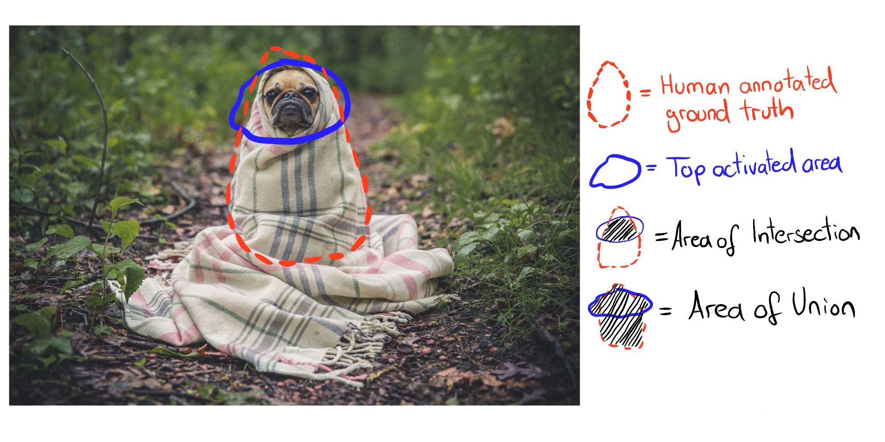
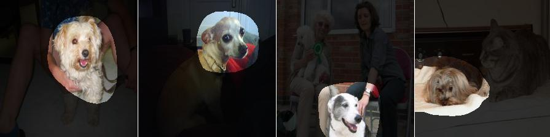

```{r, message = FALSE, warning = FALSE, echo = FALSE}
devtools::load_all()
```

## Características aprendidas{#cnn-features}

Las redes neuronales convolucionales aprenden características y conceptos abstractos de los píxeles de imagen sin procesar.
[Visualización de características](#visualización-características) visualiza las características aprendidas mediante la maximización de la activación.
[Disección de red](#disección-red) etiqueta las unidades de red neuronal (Ej., Canales) con conceptos humanos.

<!-- Antecedentes: ¿Por qué la visualización de características -->
Las redes neuronales profundas aprenden características de alto nivel en las capas ocultas.
Esta es una de sus mayores fortalezas y reduce la necesidad de ingeniería de características.
Supón que deseas construir un clasificador de imágenes con una SVM.
Las matrices de píxeles sin procesar no son la mejor entrada para entrenar su SVM, por lo que creas nuevas características basadas en color, dominio de frecuencia, detectores de bordes, etc.
Con redes neuronales convolucionales, la imagen se alimenta a la red en su forma cruda (píxeles).
La red transforma la imagen muchas veces.
Primero, la imagen atraviesa muchas capas convolucionales.
En esas capas convolucionales, la red aprende características nuevas y cada vez más complejas en sus capas.
Luego, la información de la imagen transformada atraviesa las capas completamente conectadas y se convierte en una clasificación o predicción.

```{r fig.cap ="Arquitectura de la red neuronal Inception V1. Cada unidad enumerada (3a a 5b) representa una capa con convoluciones y agrupaciones de diferentes tamaños. Figura de Olah, et al. 2019 (CC-BY 4.0) https://distill.pub/2017/activation-atlas/.", out.width = 800, include = FALSE}

```
```{r fig.cap = "Características aprendidas por una red neuronal convolucional (Inception V1) entrenada en los datos de ImageNet. Las características van desde características simples en las capas convolucionales inferiores (izquierda) hasta características más abstractas en las capas convolucionales superiores (derecha). Figura de Olah, et al. 2017 (CC-BY 4.0) https://distill.pub/2017/feature-visualization/appendix/.", out.width = 800}
knitr::include_graphics("images/cnn-features.png")
```
- Las primeras capas convolucionales aprenden características como bordes y texturas simples.
- Las capas convolucionales posteriores aprenden características como texturas y patrones más complejos.
- Las últimas capas convolucionales aprenden características como objetos o partes de objetos.
- Las capas completamente conectadas aprenden a conectar las activaciones de las características de alto nivel a las clases individuales que se preverán.

Bien.
Pero, ¿cómo obtenemos esas imágenes alucinantes?

### Visualización de características {#visualización-características}

<!-- Explicación de la visualización de funciones-->
El enfoque de hacer explícitas las características aprendidas se llama **Visualización de características**.
La visualización de características para una unidad de una red neuronal se realiza mediante la búsqueda de la entrada que maximiza la activación de esa unidad.

"Unidad" se refiere a neuronas individuales, canales (también llamados mapas de características), capas enteras o la probabilidad de clase final en la clasificación (o la neurona pre-softmax correspondiente, que se recomienda).
Las neuronas individuales son unidades atómicas de la red, por lo que obtendríamos la mayor cantidad de información creando visualizaciones de características para cada neurona.
Pero hay un problema:
Las redes neuronales a menudo contienen millones de neuronas.
Mirar la visualización de las características de cada neurona llevaría demasiado tiempo.
Los canales (a veces llamados mapas de activación) como unidades son una buena opción para la visualización de características.
Podemos ir un paso más allá y visualizar una capa convolucional completa.
Las capas como una unidad se usan para DeepDream de Google, que agrega repetidamente las características visualizadas de una capa a la imagen original, lo que resulta en una versión de entrada de ensueño.

```{r units, fig.cap = "La visualización de características se puede hacer para diferentes unidades. A) Neurona de convolución, B) Canal de convolución, C) Capa de convolución, D) Neurona, E) Capa oculta, F) Neurona de probabilidad de clase (o correspondiente neurona pre-softmax)", out.width=800}
knitr::include_graphics("images/units.jpg")
```


```{r trippy, fig.cap = "Imágenes optimizadas para Inception V1 (canales mixed3a, mixed4c, mixed4d y mixed5a). Las imágenes se maximizan para una dirección aleatoria de las activaciones. Figura de Olah, et al. 2017 (CC- BY 4.0) https://distill.pub/2017/feature-visualization/.", out.width=800, include = FALSE}
knitr::include_graphics("images/trippy.png")
```

#### Visualización de características a través de la optimización

En términos matemáticos, la visualización de características es un problema de optimización.
Suponemos que los pesos de la red neuronal son fijos, lo que significa que la red está entrenada.
Estamos buscando una nueva imagen que maximice la activación (media) de una unidad, aquí una sola neurona:

$$img^*=\arg\max_{img}h_{n,x,y,z}(img)$$

La función $h$ es la activación de una neurona, *img* la entrada de la red (una imagen), x e y describen la posición espacial de la neurona, n especifica la capa y z es el índice del canal.
Para la activación media de todo un canal z en la capa n, maximizamos:

$$img^*=\arg\max_{img}\sum_{x,y}h_{n,x,y,z}(img)$$

En esta fórmula, todas las neuronas en el canal z tienen la misma ponderación.
Alternativamente, también puedes maximizar las direcciones aleatorias, lo que significa que las neuronas se multiplicarían por diferentes parámetros, incluidas las direcciones negativas.
De esta manera, estudiamos cómo interactúan las neuronas dentro del canal.
En lugar de maximizar la activación, también puedes minimizar la activación (que corresponde a maximizar la dirección negativa).
Curiosamente, cuando maximizas la dirección negativa, obtienes características muy diferentes para la misma unidad:

```{r pos-neg, fig.cap = "Activación positiva (izquierda) y negativa (derecha) de la neurona Inception V1 484 de la capa mixed4d pre relu. Mientras que la neurona se activa al máximo por las ruedas, algo que parece tener ojos produce una activación negativa. Código: https://colab.research.google.com/github/tensorflow/lucid/blob/master/notebooks/feature-visualization/negative_neurons.ipynb", out.width = 800}
knitr::include_graphics("images/a484.png")
```

<!-- ¿Por qué no usar datos de entrenamiento? -->
Podemos abordar este problema de optimización de diferentes maneras.
Primero, ¿por qué deberíamos generar nuevas imágenes?
Simplemente podríamos buscar a través de nuestras imágenes de entrenamiento y seleccionar aquellas que maximicen la activación.
Este es un enfoque válido, pero el uso de datos de entrenamiento tiene el problema de que los elementos de las imágenes se pueden correlacionar y no podemos ver lo que realmente está buscando la red neuronal.
Si las imágenes que producen una alta activación de cierto canal muestran un perro y una pelota de tenis, no sabemos si la red neuronal mira al perro, la pelota de tenis o tal vez a ambos.

<!-- Optimización directa -->
El otro enfoque es generar nuevas imágenes, a partir del ruido aleatorio.
Para obtener visualizaciones significativas, generalmente hay restricciones en la imagen, como que solo se permiten pequeños cambios.
Para reducir el ruido en la visualización de funciones, puedes aplicar fluctuación, rotación o escala a la imagen antes del paso de optimización.
Otras opciones de regularización incluyen penalización de frecuencia (por ejemplo, reducir la varianza de los píxeles vecinos) o generar imágenes con antecedentes aprendidos, por ejemplo con redes generativas de confrontación (GAN)[^sintetizar] o autoencoder denoising [^plugandplay].

```{r activar-optim, fig.cap = "Optimización iterativa de imagen aleatoria para maximizar la activación. Olah, et al. 2017 (CC-BY 4.0) https://distill.pub/2017/feature-visualization/.", out.width = 800}
knitr::include_graphics("images/activation-optim.png")
```
Si deseas profundizar mucho más en la visualización de características, echa un vistazo al diario en línea distill.pub, especialmente la publicación de visualización de características de Olah et al. [^distill-fv], del cual utilicé muchas de las imágenes, y también sobre los bloques de construcción de la interpretabilidad [^distill-blocks].

#### Conexión a ejemplos adversarios

Existe una conexión entre la visualización de características y [ejemplos adversos](#adversarial):
Ambas técnicas maximizan la activación de una unidad de red neuronal.
Para ejemplos adversos, buscamos la activación máxima de la neurona para la clase adversaria (= incorrecta).
Una diferencia es la imagen con la que comenzamos:
Para ejemplos adversos, es la imagen para la que queremos generar la imagen adversaria.
Para la visualización de características es, según el enfoque, ruido aleatorio.

#### Texto y datos tabulares

La literatura se centra en la visualización de características para redes neuronales convolucionales para el reconocimiento de imágenes.
Técnicamente, no hay nada que te impida encontrar la entrada que activa al máximo una neurona de una red neuronal completamente conectada para datos tabulares o una red neuronal recurrente para datos de texto.
Es posible que ya no lo llame visualización de características, ya que la "característica" sería una entrada de datos tabular o texto.
Para la predicción de incumplimiento de crédito, las entradas pueden ser la cantidad de créditos anteriores, la cantidad de contratos móviles, la dirección y docenas de otras características.
La característica aprendida de una neurona sería una cierta combinación de las docenas de características.
Para redes neuronales recurrentes, es un poco más agradable visualizar lo que aprendió la red:
Karpathy et. al (2015) [^viz-rnn] mostró que las redes neuronales recurrentes tienen neuronas que aprenden características interpretables.
Entrenaron un modelo a nivel de personaje, que predice el siguiente personaje en la secuencia de los personajes anteriores.
Una vez que se produjo una llave de apertura "(", una de las neuronas se activó altamente y se desactivó cuando se produjo la llave de cierre correspondiente ")".
Otras neuronas dispararon al final de una línea.
Algunas neuronas dispararon en URL.
La diferencia con la visualización de características para CNN es que los ejemplos no se encontraron a través de la optimización, sino al estudiar las activaciones de neuronas en los datos de entrenamiento.

Algunas de las imágenes parecen mostrar conceptos bien conocidos como hocicos de perros o edificios.
Pero, ¿cómo podemos estar seguros?
El método de disección de red vincula conceptos humanos con unidades de redes neuronales individuales.
Alerta de spoiler: la disección de red requiere conjuntos de datos adicionales que alguien ha etiquetado con conceptos humanos.

### Disección de red {#disección-red}

El enfoque de disección de red de Bau & Zhou et al. (2017) [^Disect] cuantifica la interpretabilidad de una unidad de una red neuronal convolucional.
Vincula áreas altamente activadas de canales CNN con conceptos humanos (objetos, partes, texturas, colores, ...).

Los canales de una red neuronal convolucional aprenden nuevas características, como vimos en el capítulo sobre [Visualización de características](#visualización-características).
Pero estas visualizaciones no prueban que una unidad haya aprendido un cierto concepto.
Tampoco tenemos una medida de qué tan bien detecta una unidad, por ejemplo, rascacielos.
Antes de entrar en detalles sobre la disección de red, tenemos que hablar sobre la gran hipótesis que está detrás de esa línea de investigación.
La hipótesis es:
Las unidades de una red neuronal (como canales convolucionales) aprenden conceptos desenredados.

**La cuestión de las características desenredadas**

¿Las redes neuronales (convolucionales) aprenden características desenredadas?
Las características desenredadas significan que las unidades de red individuales detectan conceptos específicos del mundo real.
El canal convolucional 394 podría detectar rascacielos, el hocico del perro del canal 121, las franjas del canal 12 en un ángulo de 30 grados ...
Lo contrario de una red desenredada es una red completamente enredada.
En una red completamente enredada, por ejemplo, no habría una unidad individual para hocicos de perros.
Todos los canales contribuirían al reconocimiento de los hocicos de perros.

Las características desenredadas implican que la red es altamente interpretable.
Supongamos que tenemos una red con unidades completamente desenredadas que están etiquetadas con conceptos conocidos.
Esto abriría la posibilidad de rastrear el proceso de toma de decisiones de la red.
Por ejemplo, podríamos analizar cómo la red clasifica a los lobos contra los siberianos.
Primero, identificamos la unidad "siberianos".
Podemos verificar si esta unidad depende de las unidades "hocico del perro", "piel esponjosa" y "nieve" de la capa anterior.
Si lo hace, sabemos que clasificará erróneamente una imagen de un husky con un fondo nevado como un lobo.
En una red desenredada, podríamos identificar correlaciones no causales problemáticas.
Podríamos enumerar automáticamente todas las unidades altamente activadas y sus conceptos para explicar una predicción individual.
Podríamos detectar fácilmente el sesgo en la red neuronal.
Por ejemplo, ¿la red aprendió una característica de "piel blanca" para predecir el salario?

Alerta de spoiler: las redes neuronales convolucionales no están perfectamente desenredadas.
Ahora veremos más de cerca la disección de red para descubrir qué tan interpretables son las redes neuronales.


#### Algoritmo de disección de red

La disección de red tiene tres pasos:

1. Obtén imágenes con conceptos visuales etiquetados como humanos, desde rayas hasta rascacielos.
1. Mide las activaciones del canal CNN para estas imágenes.
1. Cuantifica la alineación de activaciones y conceptos etiquetados.

La siguiente figura visualiza cómo una imagen se reenvía a un canal y coincide con los conceptos etiquetados.

```{r fig.cap = "Para una imagen de entrada dada y una red entrenada (pesos fijos), reenviamos la imagen hasta la capa objetivo, aumentamos las activaciones para que coincidan con el tamaño de la imagen original y comparamos las activaciones máximas con la segmentación de la verdad fundamental en cuanto a píxeles. Figura originalmente de Bau & Zhou et. al. (2017).", out.width = 800}
knitr::include_graphics("images/dissection-network.png")
```


**Paso 1: Ampliar conjunto de datos**

El primer paso difícil pero crucial es la recopilación de datos.
La disección de red requiere imágenes etiquetadas en píxeles con conceptos de diferentes niveles de abstracción (desde colores hasta escenas callejeras).
Bau y Zhou et. Todos combinaron un par de conjuntos de datos con conceptos de píxeles.
Llamaron a este nuevo conjunto de datos 'Broden', que significa datos etiquetados de manera amplia y densa.
El conjunto de datos de Broden se segmenta principalmente al nivel de píxeles, para algunos conjuntos de datos se etiqueta toda la imagen.
Broden contiene 60,000 imágenes con más de 1,000 conceptos visuales en diferentes niveles de abstracción: 468 escenas, 585 objetos, 234 partes, 32 materiales, 47 texturas y 11 colores.
La siguiente figura muestra imágenes de muestra del conjunto de datos de Broden.

```{r fig.cap = "Imágenes de ejemplo del conjunto de datos de Broden. Figura originalmente de Bau & Zhou et. al (2017).", out.width = 800}
knitr::include_graphics("images/broden.png")
```

**Paso 2: recuperar las activaciones de red**

A continuación, creamos las máscaras de las áreas activadas superiores por canal y por imagen.
En este punto, las etiquetas de concepto aún no están involucradas.

- Para cada canal convolucional k:
	- Para cada imagen x en el conjunto de datos de Broden
		- Reenvía la imagen x a la capa objetivo que contiene el canal k.
		- Extrae las activaciones de píxeles del canal convolucional k: $A_k(x)$
	- Calcular la distribución de las activaciones de píxeles $\alpha_k$ sobre todas las imágenes
	- Determina el nivel de cuantificación 0.005 $T_k$ de las activaciones $\alpha_k$. Esto significa que el 0.5% de todas las activaciones del canal k para la imagen x son mayores que $T_k$.
	- Para cada imagen x en el conjunto de datos de Broden:
		- Escala el (posiblemente) mapa de activación de baja resolución $A_k(x)$ a la resolución de la imagen x. Llamamos al resultado $S_k(x)$.
		- Binariza el mapa de activación: un píxel está activado o desactivado, dependiendo de si excede el umbral de activación $T_k$. La nueva máscara es $M_k(x)=S_k(x)\geq{}T_k(x)$.

**Paso 3: alineación del concepto de activación**

Después del paso 2 tenemos una máscara de activación por canal e imagen.
Estas máscaras de activación marcan áreas altamente activadas.
Para cada canal queremos encontrar el concepto humano que activa ese canal.
Encontramos el concepto comparando las máscaras de activación con todos los conceptos etiquetados.
Cuantificamos la alineación entre la máscara de activación k y la máscara de concepto c con la puntuación de Intersección sobre Unión (IoU):

$$IoU_{k,c}=\frac{\sum|M_k(x)\bigcap{}L_c(x)|}{\sum|M_k(x)\bigcup{}L_c(x)|}$$

donde $|\cdot|$ es la cardinalidad de un conjunto.
La intersección sobre la unión compara la alineación entre dos áreas.
$IoU_{k,c}$ puede interpretarse como la precisión con la que la unidad k detecta el concepto c.
Llamamos a la unidad k un detector del concepto c cuando $IoU_{k,c}>0.04$. 
Este umbral fue elegido por Bau & Zhou et. Alabama.

La siguiente figura ilustra la intersección y unión de la máscara de activación y la máscara de concepto para una sola imagen:

```{r, fig.cap = "La Intersección sobre la Unión (IoU) se calcula comparando la anotación de verdad del terreno humano y los píxeles superiores activados.", out.width = 800}

```
La siguiente figura muestra una unidad que detecta perros:

```{r, fig.cap =" Máscara de activación para el canal 750 de inicio_4e que detecta perros con $IoU = 0.203$. Figura originalmente de Bau & Zhou et. al (2017).", out.width = 800}

```


#### Experimentos

Los autores de Network Dissection entrenaron diferentes arquitecturas de red (AlexNet, VGG, GoogleNet, ResNet) desde cero en diferentes conjuntos de datos (ImageNet, Places205, Places365).
ImageNet contiene 1,6 millones de imágenes de 1000 clases que se centran en objetos.
Places205 y Places365 contienen 2,4 millones / 1,6 millones de imágenes de 205/365 escenas diferentes.
Además, entrenaron a AlexNet en tareas de entrenamiento auto supervisadas, como predecir el orden de los cuadros de video o colorear imágenes.
Para muchas de estas configuraciones diferentes, contaron el número de detectores de conceptos únicos como una medida de interpretabilidad.
Estos son algunos de los hallazgos:

- Las redes detectan conceptos de nivel inferior (colores, texturas) en capas inferiores y conceptos de nivel superior (partes, objetos) en capas superiores.
  Ya hemos visto esto en [Visualizaciones de características] (#visualización-características).
- La normalización por lotes reduce la cantidad de detectores de concepto únicos.
- Muchas unidades detectan el mismo concepto.
Por ejemplo, hay 95 (!) Canales de perros en VGG entrenados en ImageNet cuando se usa $IoU \geq 0.04$ como límite de detección (4 en conv4_3, 91 en conv5_3, consulte [sitio web del proyecto](http://netdissect.csail.mit.edu/dissect/vgg16_imagenet/)).
- Aumentar el número de canales en una capa aumenta el número de unidades interpretables.
- Las inicializaciones aleatorias (entrenamiento con diferentes semillas aleatorias) dan como resultado números ligeramente diferentes de unidades interpretables.
- ResNet es la arquitectura de red con el mayor número de detectores únicos, seguida por VGG, GoogleNet y AlexNet.
- El mayor número de detectores de conceptos únicos se aprende para Places356, seguido de Places205 e ImageNet en último lugar.
- El número de detectores de concepto únicos aumenta con el número de iteraciones de entrenamiento.
```{r fig.cap = "ResNet entrenado en Places365 tiene el mayor número de detectores únicos. AlexNet con pesos aleatorios tiene el menor número de detectores únicos y sirve como línea de base. Figura originalmente de Bau & Zhou et. al (2017)."}
knitr::include_graphics("images/arch-compare.png")
```
- Las redes entrenadas en tareas auto supervisadas tienen menos detectores únicos en comparación con las redes entrenadas en tareas supervisadas.
- En el aprendizaje por transferencia, el concepto de un canal puede cambiar. Por ejemplo, un detector de perros se convirtió en un detector de cascada. Esto sucedió en un modelo que inicialmente se entrenó para clasificar objetos y luego se ajustó para clasificar escenas.
- En uno de los experimentos, los autores proyectaron los canales en una nueva base girada.
Esto se hizo para la red VGG entrenada en ImageNet.
"Girado" no significa que la imagen se haya girado.
"Girado" significa que tomamos los 256 canales de la capa conv5 y calculamos los nuevos 256 canales como combinaciones lineales de los canales originales.
En el proceso, los canales se enredan.
La rotación reduce la capacidad de interpretación, es decir, el número de canales alineados con un concepto disminuye.
La rotación fue diseñada para mantener el rendimiento del modelo igual.
La primera conclusión:
La interpretabilidad de las CNN depende del eje.
Esto significa que las combinaciones aleatorias de canales tienen menos probabilidades de detectar conceptos únicos.
La segunda conclusión:
 La interpretabilidad es independiente del poder discriminativo.
 Los canales se pueden transformar con transformaciones ortogonales, mientras que el poder discriminativo sigue siendo el mismo, pero la interpretabilidad disminuye.
```{r fig.cap = "El número de detectores de concepto únicos disminuye cuando los 256 canales de AlexNet conv5 (entrenados en ImageNet) se cambian gradualmente a una base utilizando una transformación ortogonal aleatoria. Figura originalmente de Bau & Zhou et. al (2017)."}
knitr::include_graphics("images/rotation-dissect.png")
```

Los autores también utilizaron Disección de red para redes adversas generativas (GAN).
Puedes encontrar Disección de red para GAN en [el sitio web del proyecto](https://gandissect.csail.mit.edu/).

### Ventajas

Las visualizaciones de funciones brindan **una visión única del funcionamiento de las redes neuronales**, especialmente para el reconocimiento de imágenes.
Dada la complejidad y la opacidad de las redes neuronales, la visualización de características es un paso importante en el análisis y la descripción de las redes neuronales.
A través de la visualización de características, hemos aprendido que las redes neuronales primero aprenden detectores simples de bordes y texturas y detectores de partes y objetos más abstractos en capas superiores.
La disección de red amplía esos conocimientos y hace que la capacidad de interpretación de las unidades de red sea medible.

La disección de red nos permite **vincular automáticamente unidades a conceptos**, lo cual es muy conveniente.

La visualización de características es una gran herramienta para **comunicar de manera no técnica cómo funcionan las redes neuronales**.

Con la disección de red, también podemos **detectar conceptos más allá de las clases en la tarea de clasificación**.
Pero necesitamos conjuntos de datos que contengan imágenes con conceptos etiquetados en píxeles.

La visualización de características se puede **combinar con métodos de atribución de características**, que explican qué píxeles fueron importantes para la clasificación.
La combinación de ambos métodos permite explicar una clasificación individual junto con la visualización local de las características aprendidas que estuvieron involucradas en la clasificación.
Consulta [Los componentes básicos de la interpretabilidad de distill.pub](https://distill.pub/2018/building-blocks/).

Finalmente, las visualizaciones de características hacen **excelentes fondos de escritorio y estampados de camisetas**.


### Desventajas

**Muchas imágenes de visualización de características no son interpretables**, pero contienen algunas características abstractas para las cuales no tenemos palabras o conceptos mentales.
La visualización de visualizaciones de características junto con datos de entrenamiento puede ayudar.
Es posible que las imágenes aún no revelen a qué reaccionó la red neuronal y solo muestren algo como "tal vez debe haber algo amarillo en las imágenes".
Incluso con la disección de red, algunos canales no están vinculados a un concepto humano.
Por ejemplo, la capa conv5_3 de VGG entrenada en ImageNet tiene 193 canales (de 512) que no se pueden combinar con un concepto humano.

Hay **demasiadas unidades para mirar**, incluso cuando "solo" visualiza las activaciones del canal.
Para Inception V1 ya hay más de 5000 canales de 9 capas convolucionales.
Si también deseas mostrar las activaciones negativas más algunas imágenes de los datos de entrenamiento que activan el canal de manera máxima o mínima (digamos 4 imágenes positivas, 4 negativas), entonces ya debes mostrar más de 50 000 imágenes.
Al menos sabemos, gracias a la disección de red, que no necesitamos investigar direcciones aleatorias.

**¿Ilusión de interpretabilidad?**
Las visualizaciones de características pueden transmitir la ilusión de que entendemos lo que está haciendo la red neuronal.
¿Pero realmente entendemos lo que está sucediendo en la red neuronal?
Incluso si observamos cientos o miles de visualizaciones de características, no podemos entender la red neuronal.
Los canales interactúan de manera compleja, las activaciones positivas y negativas no están relacionadas, las neuronas múltiples pueden aprender características muy similares y para muchas de las características no tenemos conceptos humanos equivalentes.
No debemos caer en la trampa de creer que entendemos completamente las redes neuronales solo porque creemos que vimos que la neurona 349 en la capa 7 es activada por las margaritas.
La disección de red mostró que arquitecturas como ResNet o Inception tienen unidades que reaccionan a ciertos conceptos.
Pero el IoU no es tan bueno y, a menudo, muchas unidades responden al mismo concepto y algunas a ningún concepto.
Sus canales no están completamente desenredados y no podemos interpretarlos de forma aislada.

Para la disección de red, **necesitas conjuntos de datos que estén etiquetados en el nivel de píxel** con los conceptos.
Estos conjuntos de datos requieren mucho esfuerzo para recopilarse, ya que cada píxel debe etiquetarse, lo que generalmente funciona dibujando segmentos alrededor de los objetos de la imagen.

La disección de red solo alinea los conceptos humanos con activaciones positivas pero no con activaciones negativas de canales.
Como lo mostraron las visualizaciones de características, las activaciones negativas parecen estar vinculadas a conceptos.
Esto podría solucionarse mirando adicionalmente el cuantil más bajo de activaciones.

### Software y material adicional

Hay una implementación de código abierto de visualización de características llamada [Lucid](https://github.com/tensorflow/lucid).
Puede probarlo convenientemente en su navegador utilizando los enlaces del cuaderno que se proporcionan en la página Lucid Github.
No se requiere software adicional.
Otras implementaciones son [tf_cnnvis](https://github.com/InFoCusp/tf_cnnvis) para TensorFlow, [Keras Filters](https://github.com/jacobgil/keras-filter-visualization) para Keras y [DeepVis] ( https://github.com/yosinski/deep-visualization-toolbox) para Caffe.

Network Dissection tiene un excelente [sitio web del proyecto](http://netdissect.csail.mit.edu/).
Junto a la publicación, el sitio web aloja material adicional como código, datos y visualizaciones de máscaras de activación.

[^distill-fv]: Olah, et al., "Feature Visualization", Distill, 2017.

[^distill-blocks]: Olah, et al., "The Building Blocks of Interpretability", Distill, 2018.

[^plugandplay]: Nguyen, Anh, et al. "Plug & play generative networks: Conditional iterative generation of images in latent space." Proceedings of the IEEE Conference on Computer Vision and Pattern Recognition. 2017.

[^synthesize]: Nguyen, Anh, et al. "Synthesizing the preferred inputs for neurons in neural networks via deep generator networks." Advances in Neural Information Processing Systems. 2016.

[^viz-rnn]: Karpathy, Andrej, Justin Johnson, and Li Fei-Fei. "Visualizing and understanding recurrent networks." arXiv preprint arXiv:1506.02078 (2015).

[^dissect]: Bau, David, et al. "Network dissection: Quantifying interpretability of deep visual representations." Proceedings of the IEEE Conference on Computer Vision and Pattern Recognition. 2017.

[^imagenet]: Olga Russakovsky*, Jia Deng*, Hao Su, Jonathan Krause, Sanjeev Satheesh, Sean Ma, Zhiheng Huang, Andrej Karpathy, Aditya Khosla, Michael Bernstein, Alexander C. Berg and Li Fei-Fei. (* = equal contribution) ImageNet Large Scale Visual Recognition Challenge. IJCV, 2015

